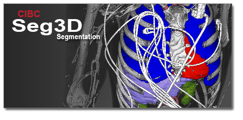

Welcome to Seg3D's Documentation!
=================================

Seg3D (`www.seg3d.org <http://www.seg3d.org>`_) is a free volume segmentation and processing tool developed by the NIH Center for Integrative Biomedical Computing at the University of Utah Scientific Computing and Imaging (SCI) Institute.

Installation
------------
Check the :doc:`Platform Specifications <dev_docs/specs>` for system requirements.

`Installers <https://github.com/SCIInstitute/Seg3D/releases>`_ are provided for Windows and Mac OS X. Linux users need to build Seg3D from :doc:`source </dev_docs/build>`

User Documentation
------------------
A :doc:`basic functionality manual </user_docs/functions>`, :doc:`tool and filter reference </user_docs/tools>`, and :doc:`tutorial </tutorials/Seg3DTutorial>` are available.

..
   user doc tree

.. toctree::
   :maxdepth: 1
   :glob:
   :hidden:
   :caption: User Documentation:

   user_docs/*

..
   tutorial tree

.. toctree::
   :maxdepth: 1
   :glob:
   :hidden:
   :caption: Tutorials:

   tutorials/*

..
   dev tree

.. toctree::
   :maxdepth: 1
   :glob:
   :hidden:
   :caption: Developer Documentation:

   dev_docs/*

..
   python tree

.. toctree::
   :maxdepth: 1
   :glob:
   :hidden:
   :caption: Python Documentation:

   py_docs/*

..
   bib tree

.. toctree::
   :maxdepth: 1
   :hidden:
   :caption: Bibliography:

   bib

Indices and tables
------------------

* :ref:`genindex`
* :ref:`modindex`
* :ref:`search`
