Seg3D Tutorial
===============

## Overview

This tutorial describes step by step instructions to segment Ascending and Descending Aorta in cardiac MRI and describes the segmentation of skull, gray and white matter in a head dataset.

### Software Requirements

#### Seg3D

Seg3D is distributed as a binary download for Linux, Windows, and OS X. Please visit the [SCI software portal](https://github.com/sciinstitute/seg3d) to download the latest Seg3D. Any version of 2.0 or higher will do.

#### Required Datasets

This tutorial uses two datasets. The first one is a set of two 3D scans, one is an anatomical MRI of the atria and the second one is a delayed enhanced MR image of the same region. Both images have been registered. The second data is a brain data set that contains a preoperative MR image of the brain and a post surgery CT image of a pediatric patient.

The datasets are available in the SCIRunData zip files. Please visit [SCIRun Data](http://www.scirun.org) to download the datasets. The datasets for this tutorial are inside the Seg3D directory. The direct linked to the zipped SCIRun Datasets can be found [here](https://www.sci.utah.edu/releases/scirun_v4.6/SCIRunData_4.6_20130913_data.zip).

## Basic Orientation

### Starting Seg3D

When you start Seg3D, you will be greeted by the welcome screen ({numref}`fig-welcome`). As you will see, you have some options: you may load a recent project from the list (likely to be empty), open a project that you have saved on your machine, start a new project, take a quick look at a single segmentation or image file, or you may quit Seg3D if you have changed your mind.

:::{figure-md} fig-welcome

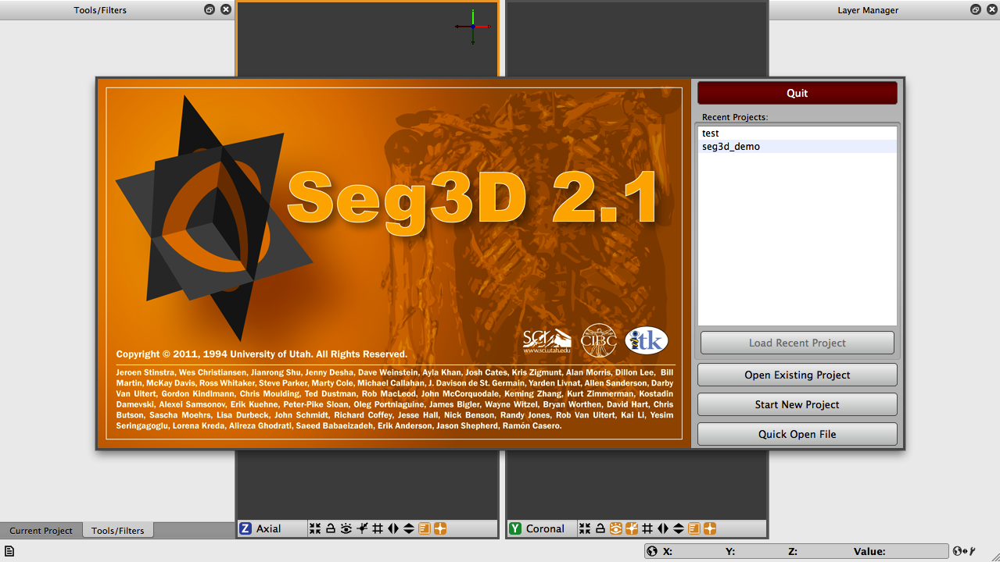

Seg3D welcome screen.
:::

Seg3D handles your data mainly in the form of projects which are similar to those used in other applications. A project consists of a group of files and with this set up, Seg3D is able to track and save your data that you are working on, the settings that you are using, and the tools and filters that you are using. This is very useful, especially as your segmentations become larger and more complicated. For now, we will begin by starting a new project. Once you choose to open a new project, you will be asked to choose a name and location for the project. Test\_1 will do for a name and the default location will be a directory that was created during installation called Seg3D-Projects. You can use this directory to store future projects.

### Loading A Dataset

In order to get a good feel for the Seg3D program, one needs to load a dataset. Please open up the file menu and select the **Import Layer From Single File...** menu item as indicated in {numref}`fig-load-volume`. This opens up a file browser. Browse to the Heart\_DataSet directory and select this one to load the DEMRI.NRRD file.

:::{figure-md} fig-load-volume

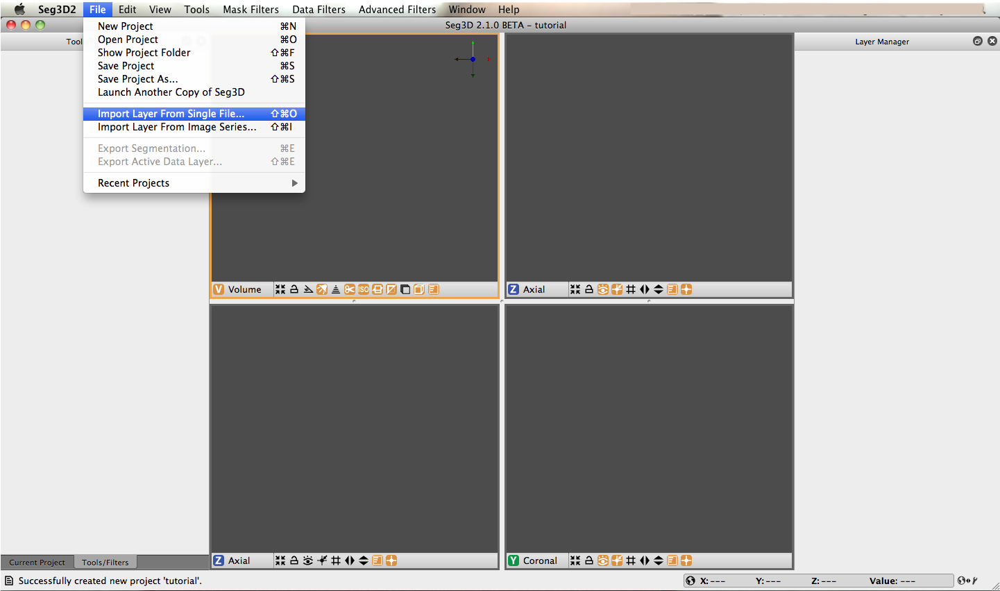

Loading a volume.
:::

The layer importer widget will then appear ({numref}`fig-load-volume2`). This widget is for distinguishing how the data from the file is read and the widget is especially needed when loading previously saved label masks. For this dataset, choose the only available option, which is **Data Volume**. This will load the file as a gray scale image volume.

:::{figure-md} fig-load-volume2

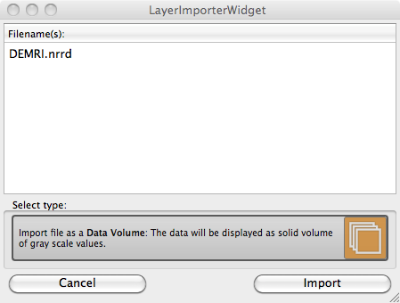

Chose type of data to load.
:::

Note: we converted the datasets for this demo into the *NRRD* dataset format as it does not contain any patient information. For more information on NRRD filetypes, refer to [the NRRD Format](http://teem.sourceforge.net/nrrd/format.html). Seg3D reads [DICOM](http://en.wikipedia.org/wiki/DICOM) files as well and any image file format supported by the Insight ToolKit, as well as Matlab files. For additional supported filetypes, view the filetype drop-down menu that appears while browsing to open a file. The browser decides which file format to use based on the extension of the file.

:::{figure-md} fig-main-seg3d-window

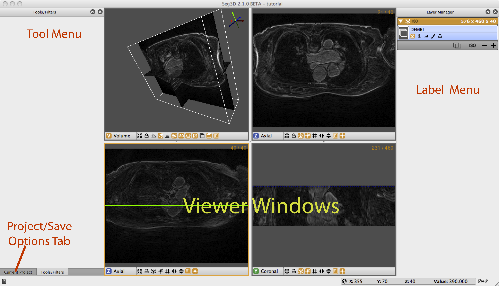

The main Seg3D window.
:::

Once the file has loaded one can see the data being displayed in the 3 slice views and the 3D viewer. The layout of the Seg3D program is highlighted in the {numref}`fig-main-seg3d-window`. On the top left one has a tool menu that will show the options of the currently loaded tool and is currently empty. On the right one can see the layer menu. Each layer in Seg3D is a separate volume and the order in the Layer Editor depicts the order in which datasets are being shown. In the center one has the three orthogonal views and one 3D viewer and to the lower left one can browse the position of the active dataset and sample the value.

Some tools require data to be represented in a histogram, which would be shown in the tool menu. The histogram shows pixel intensities in a cross section of the image, and the data from the histograms is used for image filtering. The data in the histogram can be represented in either a logarithmic or a linear format, with the linear format showing linear values, which often results in more dramatic intensity gradients, and the logarithmic format showing an alternative, with lower intensities receiving a greater emphasis.

### Navigation

Note: These operations are based on a setup that involves a three-button mouse. For other configurations, see **Keyboard Shortcuts** in the Help menu ({numref}`fig-keyboard-shortcuts`).

:::{figure-md} fig-keyboard-shortcuts

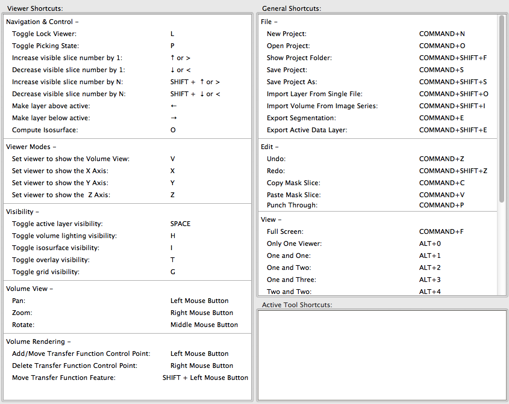

The keyboard shortcuts as found in the help menu.
:::

Brightness  
Move the mouse up and down while pressing left mouse button (only when a volume layer is selected).

Contrast  
Move the mouse left and right while pressing left mouse button (only when a volume layer is selected).

Pan Volume  
Press shift and move volume while clicking left mouse button (Volume view only).

Zoom  
Move the mouse up and down while pressing the right mouse button (Volume view only).

Rotate  
Move the mouse while pressing the middle mouse button in the 3D viewer (Volume view only).

Move slice orthogonal slices  
Move the mouse while pressing the middle mouse button in the 2D view windows. This will change the location of the two colored lines, which represent the location of the two other slice windows.

Move slice depth  
Use the mouse wheel to move to the next slice. Or use the up and down arrow keys, or the **&lt;** and **&gt;** keys, to navigate through a slice.

Painting  
In painting mode the mouse wheel is the size of the brush, hence to move through slices use the up and down arrow keys, or the **&lt;** and **&gt;** key.

Plane visibility  
Press space to switch off viewing the image and space again to switch it on (all views, masks remain visible).

Navigate through the data and rotate the 3D image.

### Changing Views

To alter the views that are displayed in the window. Press on the Red, Green, or Blue tab at the top of each Viewer to show a different viewer. By clicking on the labels one loops through the four main modes of each window.

In the **Views** menu one can further specify the layout of the views. One can choose from:

Only one viewer  
Just showing one window.

One and One  
Two viewers side by side.

One and Two  
Make one big viewer and two smaller ones.

One and Three  
The default

Two by Two  
Four views of equal size.

Two and Three  
Make two viewers big and three smaller.

Three and Three  
Make six viewers.

There is also an option for a full screen mode which will fill the entire computer screen with the Seg3D window. The top menu will pop down when the cursor is moved to the top of the screen.

### Loading a second dataset

Open the **Import Layer From Single File...** menu once more and now load the Angio.NRRD dataset by choosing **Data Volume**. After loading this dataset, two datasets are present in the menu on the right. You can see that because the data sets are in a different group, *i.e.*, they each have an orange header, the volumes are slightly different. By clicking on the *i* button for each volume you can see that the origins are slightly different. You may correct this using the **Transform** tool. With this tool you can change the origin of one volume to match the other. The corrected volume will then join the other into a single group. This step is not needed for the purposes of this tutorial, but tools and filters that use two layers as inputs cannot use layers of different groups.

Press on the eye to show which layer is visible. As volume layers are full data layers they completely clutter the underlying image. Switch on the visibility (using the eye) of both layers and toggle the visibility of the top most layer. The top most is the one found on top of the menu. The blue highlight set the selected layer. Select the top layer and press space and press space again (put the cursor in the Viewer Window). This option can be used to quickly view the difference between layers.

## Simple Operator Based Segmentation Strategies

### DEMRI Dataset

In this section we will use the paint and polyline tools to segment a simple structure, the aorta, from the DEMRI dataset. Delayed enhancement MRI (DEMRI) makes use of the contrast enhancement that gadolinium (Gd) provides in MR imaging. In this scan Gd was injected via IV into the patient’s venous system. As the Gd washes through the system it enters and exits tissues at variable rates. In this case, 15 minutes after administration, the Gd has washed into and out of most tissue. Enhanced tissues that continue to sequester Gd are assumed to have disrupted, or altered vascular perfusion. This method has be used to detect cardiac ischemia, infarct, and scarring. This particular DEMRI dataset was used to evaluate post-operative scarring in the left atrium. To get started, we will be looking at the ascending and descending aorta.

### Label Masks

Seg3D has two types of layers that can operated on by different tools and filters. These are volume and label masks. Volumes are image data that has been loaded in, or produced by one of the filters. The DEMRI and Angio datasets loaded in the first section are volumes, and appear left aligned on the Layer Menu. If you select the + button below either of these volumes a new layer with the name ’Mask Layer’ appears indented above the volume. This is a label mask, and you may rename it anytime by clicking on the name of the layer. The label mask displays the segmented regions of interest as a colored opaque layer. When using any tool or feature it is important to know whether it operates on a volume, label mask, or both.

### Paint Tool

The paint and polyline tools allow the user to directly select regions of interest for segmentation. The paint tool presents as a circle icon of adjustable radius that can select regions of interest by holding down the left mouse button and moving the icon over the desired object.

Begin by selecting Paint Brush under Tools on the menu bar. When the circular icon appears, experiment with the tool by moving it over the three orthogonal image planes. You will notice that the icon is elliptical over the Coronal and Sagittal planes and is circular over the Axial plane. Click on the i button under DEMRI on the Layer Menu and information about the volume will open. Next to Spacing is listed the voxel dimensions (0.62, 0.62, 2.5). With respect to the Axial plane this means the slice thickness is nearly 4X the size of X-Y spacing. When using other features in Seg3D it is important to remember that the anisotropy of your data is preserved.

Prepare to segment by clicking on the + widget under DEMRI on the Layer Menu to create a label mask. Begin segmentation of the aorta by navigating the Paint icon over the **Descending Aorta** on the axial plane. Adjust the diameter of the tool with the scroll wheel, or by holding the right mouse button until it just fills the lumen of the aorta. Once you have positioned and sized the icon click the left mouse button. The circle icon should then fill with the same color of the selected label mask. Proceed to the next few slices painting the lumen of each one ({numref}`fig-paint-lumen`). Next, create a new label mask, and expand the diameter of the Paint icon so it encircles the outer diameter, or superficial surface of the aorta. Now paint the superficial surface of the same slices. It is possible to erase painting on the label mask by holding the right mouse button and moving the icon over the region to be erased.

:::{figure-md} fig-paint-lumen

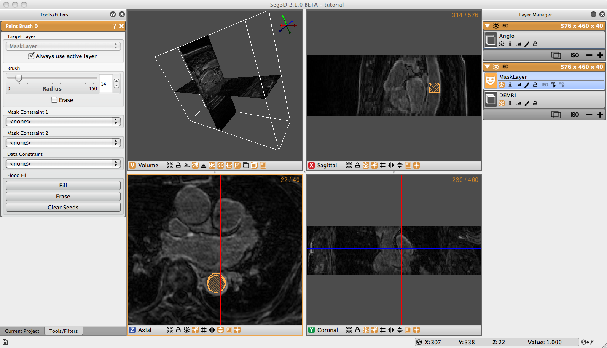

Painting the lumen of the descending aorta.
:::

### Polyline Tool

The Polyline Tool may be better suited for segmentation of complex shapes. The polyline tool is operated by selecting points, with the left mouse button, around the perimeter of the region of interest. Each point added is connected to the point before it and to the first point selected making a closed polygon. Both tools display the selected regions of interest in label masks.

:::{figure-md} fig-polyline-superficial

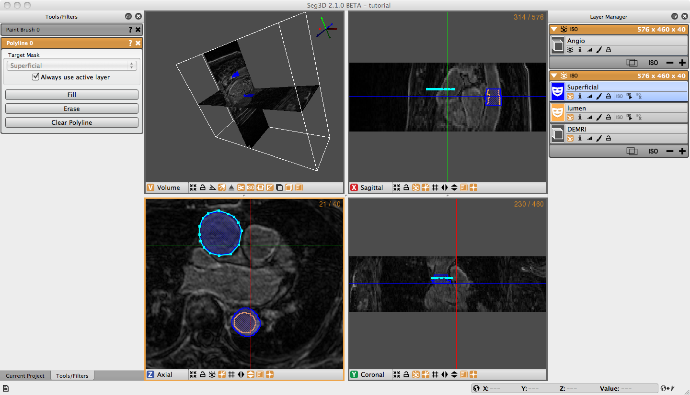

Polyline for masking the superficial surface of the ascending aorta.
:::

Open the Polyline Tool under the Tools menu on the menu bar. Without changing the label mask, begin clicking points around the superficial surface of the **Ascending Aorta** ({numref}`fig-polyline-superficial`). If you are not satisfied with the location of a point you can move it by moving your cursor over the point, when the cursor turns into a had or a thicker cross, you may move the point by left clicking on it and dragging it to the desired location. Or, you can simply delete the point by right clicking on the point when when the cursor changes. The polyline tool will automatically try to place the point in the order that completes the smoothest shape, so when your are outlining a concave shape, make a convex shape, then add more points to make it concave. Once you have traced the superficial surface all the way around click fill on the Tool Menu, or simply press F on the keyboard. The region surrounded by the polyline should fill with the color of the selected label mask. Navigate to the next slice, and notice that the polyline does not disappear. If the polyline still matches the region of interest, simply hit F. To adjust the polyline hold shift cand left click on one point and drag to move the entire polyline, or move individual points as described before. If you want to start over hit Clear Polyline button in the tool options on the left. It is also possible to erase regions of the label mask with the Polyline tool by creating a polyline around the region to be erased and selecting erase on the Tool Menu. After creating the superficial surface label masks hide the masks by clicking on the eye widget, select the lumen label mask, and use the Polyline tool to create lumen masks on the **Ascending Aorta** ({numref}`fig-polyline-lumen`).

:::{figure-md} fig-polyline-lumen

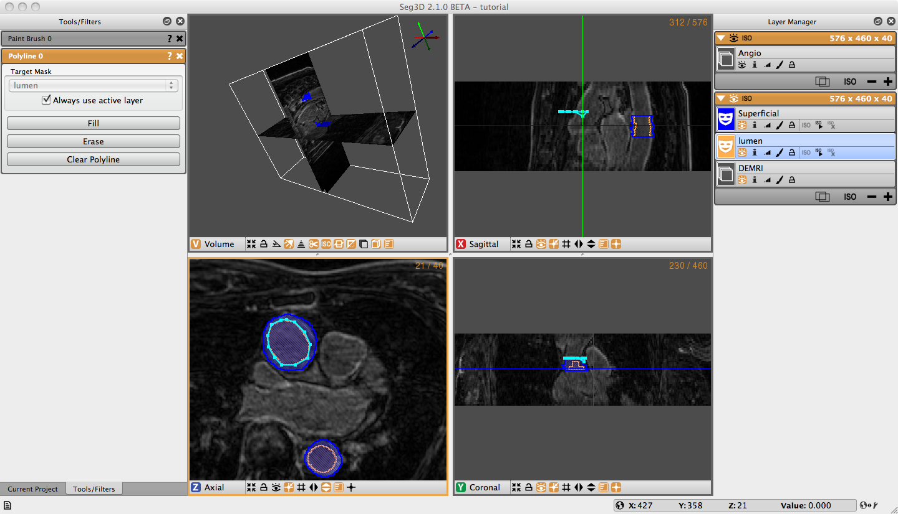

Polyline for masking the lumen of the ascending aorta.
:::

### Logical Operators

:::{figure-md} fig-logical-operators

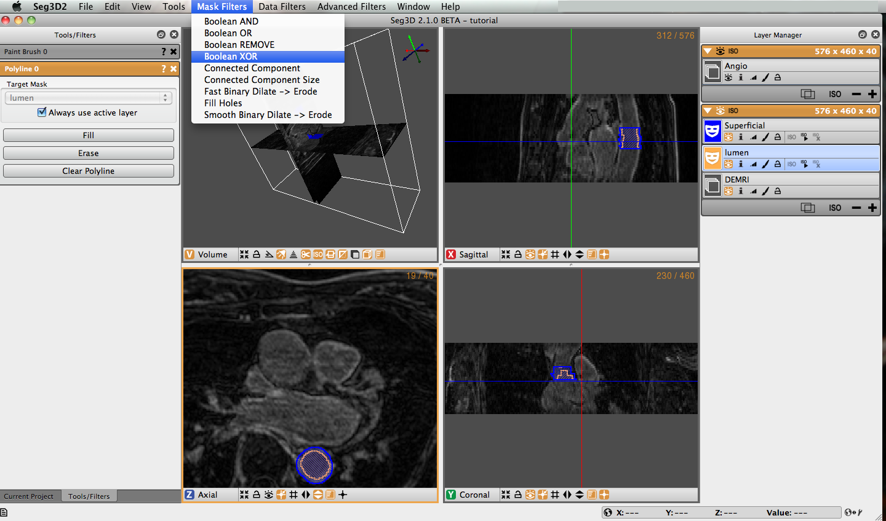

Creating label mask of region of interest with logical operators.
:::

Once you have masked the lumen and superficial surface of both the ascending and descending aorta we can use logical operators to mask the real region of interest, the aorta wall. Under Mask Filters on the menu bar, select Boolean Xor. Highlight either of the label masks. You will notice that the name of the highlighted filter will appear in the target layer field. You can change this by unchecking the ‘Always use active layer’ option. Choose the other label mask in the Mask Layer option by selecting it from the list of eligible layers, or by holding down shift and clicking on the face color image of desired layer and dragging it to the option list. Click on the Run Filter button, this will create a new label mask that only covers the aorta wall ({numref}`fig-logical-operators`). The resulting layer is shown in {numref}`fig-creating-isosurface`. Notice there is an option called Replace on the bottom of the tool menu. Most of the filters have this option. It will replace the target layer with the result of the filter. This is very useful when you do not need the unmodified layer after you run the filter.

:::{figure-md}  fig-creating-isosurface

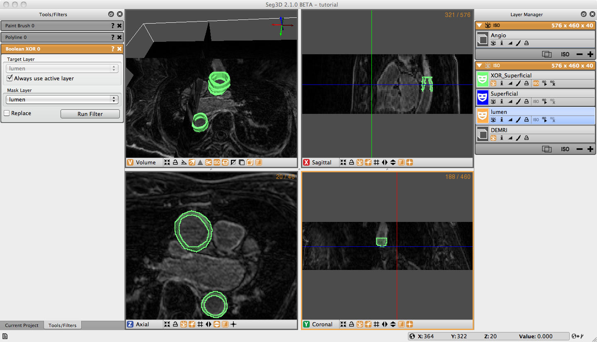

Creating isosurface of label mask.
:::

### Isosurface

To create a three dimensional isosurface of the Xor label mask, simply click the create isosurface icon (‘ISO ’) for the layer. It may sometimes be necessary to delete an isosurface that has already been created if you run a filter with the replace option (‘ISO ×’). Once Xor is the only layer highlighted, click the create isosurface icon on the Xor layer window. Now the 3D View in the upper right corner should display the 3D isosurface (shown in figure above). Navigate around the volume with the normal zoom and pan volume short keys. Holding the alt/option key and clicking (or middle click) on the volume will allow you to rotate the object. Experiment with the widgets in the bottom of the 3D viewer to turn on and off various elements of the display.

### Mask Data

To extract the data covered by the label mask select the Mask Data option under the Data Filters menu. Choose the label mask you want to use to extract data with and click Set Label Mask in the Tools Menu. Select the Data layer you want to extract data from (DEMRI in this case), which should appear in the Target Layer field. Then choose the Mask Layer you wish to mask the data with (XOR\_Superficial) from the drop down menu or by dragging the layer to the field. Set the background value to the desired setting (min\_value), then click the Run Filter button. A new data layer will appear in the Layer Menu (called MaskData\_DEMRI). This should show only the region of interest from the masked volume ({numref}`fig-mask-data`). You may need to toggle off the viewing of the mask layers to see the data.

:::{figure-md} fig-mask-data

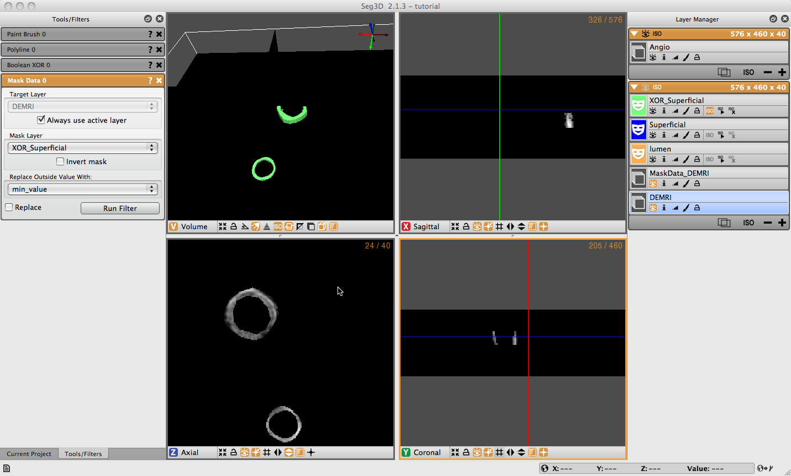

Using label mask to extract data from volume.
:::

### Saving

At this point there are multiple options for saving the work that you have done. Under the File menu are the options: Save Project, Save Project as ..., Export Segmentation, and Export Active Data Layer. There are hotkeys for these functions and many others that can be see by clicking the help menu then Keyboard Shortcuts. Save Project/Save Project as ... will save the work that you done to this point in for later restoration. The Export Segmentation option save the label masks that you have created. Export Active Data Layer will save the image data selected in the Layer Menu. Individual mask and data layers may be exported by right clicking on the layers and choosing Export Segmentation/Data as... and then choosing the file type. As apparent, the export data types available are image stacks (bitmap, png, tiff, dicom), matlab v7.3, and NRRD (see <http://teem.sourceforge.net/nrrd/>). The preferred data format for CIBC software is NRRD, and is required for using BioMesh3D, a tetrahedral mesh generation software also developed by CIBC <http://biomesh3d.com>.

## Filters and Threshold Tool

### Loading Angiogram

The second cardiac dataset that is part of this example is the angiogram. For this part of the tutorial load the Angio.NRRD file. Use the **Import Layer From Single File...** menu in the File Menu to load this dataset. An example of this dataset is depicted {numref}`fig-angio-data`.

:::{figure-md} fig-angio-data

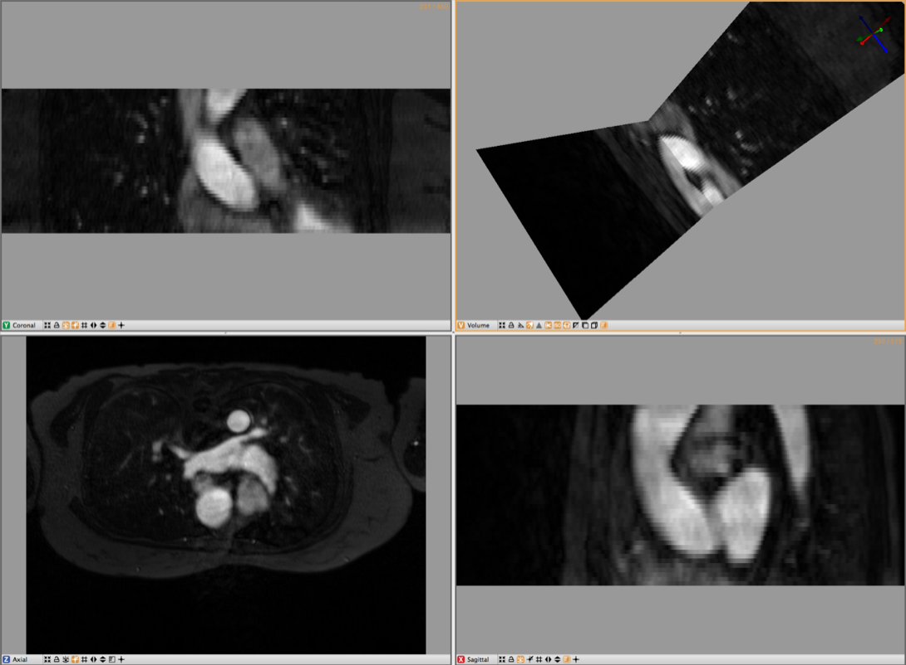

Angiogram.
:::

This dataset was previously registered to the DEMRI.NRRD dataset. As both datasets have the sampling distance and coordinate system. One can use label mask from the DEMRI dataset in the Angio dataset and vice versa.

### Filtering data

As we want to use the threshold tool on the Angiogram data to segment out the inner wall of the both ascending and descending aortas, the data noise in the MR image needs to be suppressed. In this example we use a Median Filter and Gaussian Blur to filter the data.

Open up the **Median Filters** from the Filters menu and select the Angio data layer as the target. The radius indicates the number of the neighboring pixels that is used to derive the median from. In this case the default setting of one will be sufficient. Run the filter and compare the results by pressing space to toggle on and off the selected layer, which in this case should be the top most layer that was just generated if there are no mask layers present.

The second stage of filtering uses the **Gaussian Blur** from the **Data Filters** Menu. Again the default settings will do. Select the output from the median filter and run this filter. After filtering the data will look like the results depicted in {numref}`fig-filtered-angio-data`.

:::{figure-md} fig-filtered-angio-data

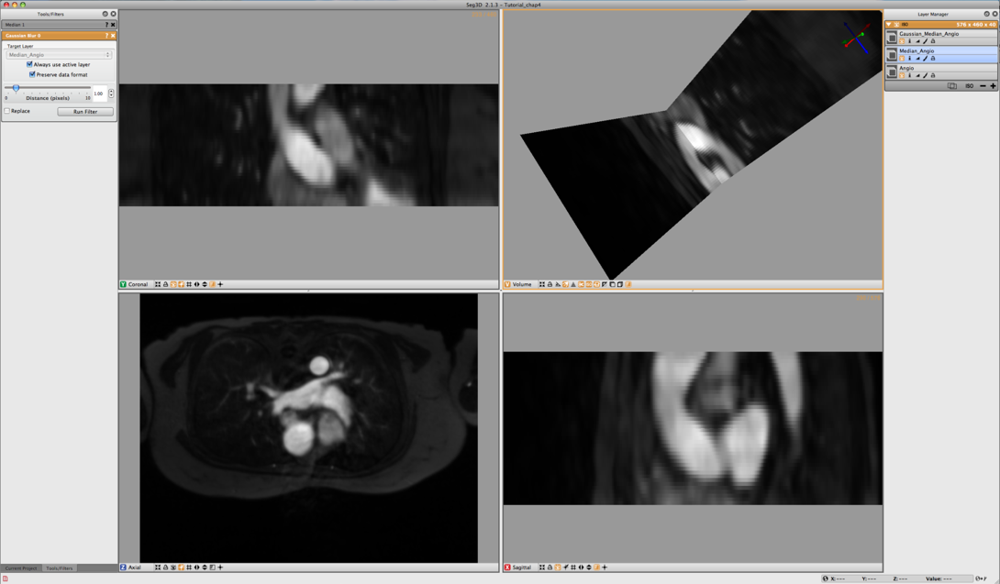

Median and Gaussian filtered Angiogram.
:::

### Threshold Tool

To select the blood from the segmentation, use the **Threshold Tool** from the Tools menu. Once this tool has been opened, choose the filtered angio as the target and use the sliders to adjust the threshold values. In order to do this, switch off the visibility of both the filtered Angio datasets as well as the original Angio dataset and make the DEMRI visible. This will allow you to interactively generate a segmentation of the blood using the DEMRI as a visual confirmation, and filtered angio data for the threshold. Once the segmentation looks good press **Create Threshold Layer** in the Threshold Menu to generate the label layer. (see {numref}`fig-threshold-angio`) The threshold tool however segments both aortas and the left atrium. To select just one of the of the vessels, select the newly created label layer and then select **Mask Data** in the Data Filters Menu.

:::{figure-md} fig-threshold-angio

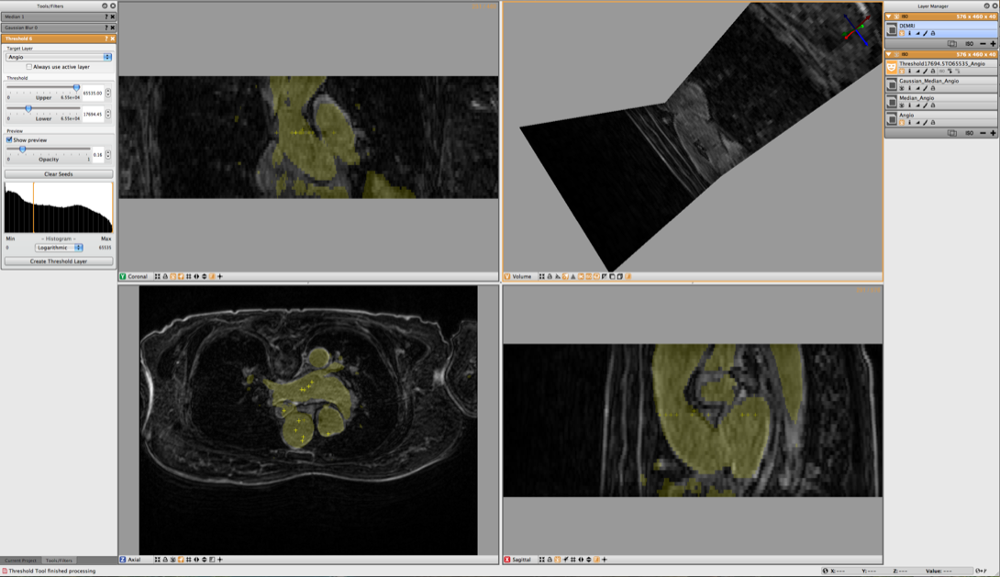

Thresholding Angiogram while looking at DEMRI.
:::

Now create a new layer by pressing on the + symbol in this layer. This will generate a new empty layer with the same dimensions. Now open up the **Paint Brush** in the Tools Menu. Select the Mask Layer for theTarget Layer in the Paint Brush Menu. Then under **Mask Constraint 1** select the Threshold Angio and start painting the Ascending Aorta. As a mask has been set the painting will be restricted to previously segmented blood. (see {numref}`fig-masked-painting`)

:::{figure-md} fig-masked-painting

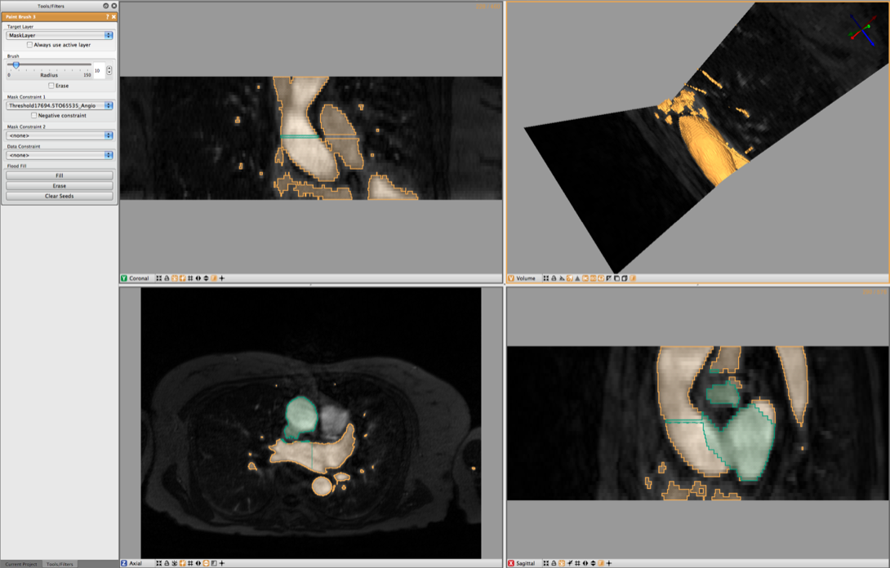

Painting a label while masking from another label.
:::

Paint a couple of slices and then generate the isosurface of the vessel. Once you have captured the vessel to your satisfaction, you may export the segmentation as described in the previous chapter.

### Otsu Threshold

Another thresholding tool available in the Data Filters menu is the Otsu Threshold. The Otsu Threshold uses an image intensity histogram to determine adequate threshold levels and segment the image based on the determined threshold levels. A demonstration of the Otsu Threshold will be done on the CT image that was taken on the 15 year old pediatric patient.The file can be found in the SCIRun datasets (see [Software Requirements](#software-requirements)). We will be working with the CTbrain50.NRRD file found in the SCIRunData/Seg3D/Brain\_DataSet directory.

To use the Otsu Threshold, first select the **Otsu Threshold** tool from the **Data Filters** menu. The tools window will then show the information on the Otsu Threshold tool. The target layer may be selected, and the number of thresholds can be selected, from zero to four different thresholding layers. Below the number of thresholds is the histogram representing the intensities of the pixels of the image ({numref}`fig-otsu-before`). The menu box below the histogram allows the user to select whether they would like a logarithmic or a linear graph.

:::{figure-md} fig-otsu-before

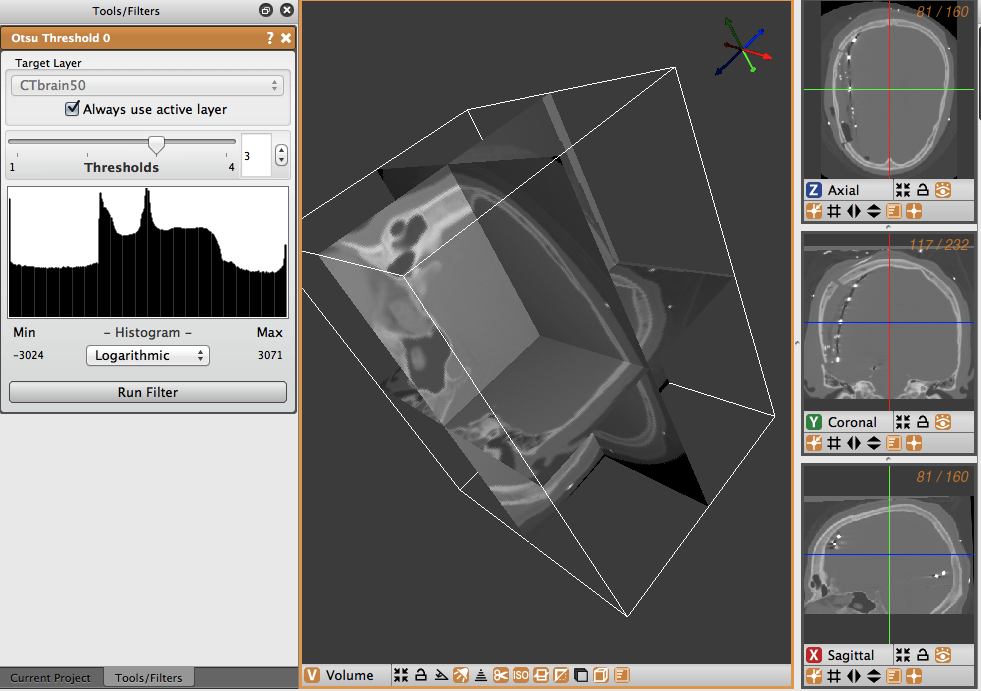

Brain data before Otsu thresholding.
:::

To use the Otsu Threshold tool on the brain CT image, select the tool and then choose three as the number of thresholds. Select logarithmic for the display of the histogram, and run the filter. The thresholded layers will appear in the layers view on the right. The number of layers corresponds to the number of thresholds selected in the tool view. In the brain data, the tool created different layers for dense matter like bone, other less dense matter, and air ({numref}`fig-otsu-after`).

:::{figure-md} fig-otsu-after

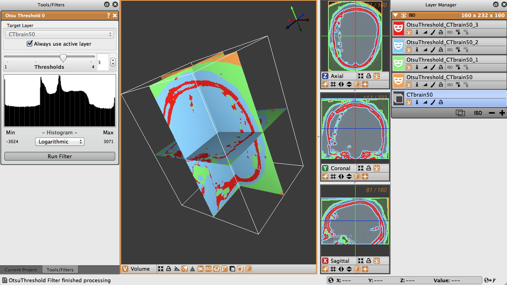

Brain data after Otsu thresholding.
:::

### Canny Edge Detection Filter

An advanced tool for edge detection is the Canny Edge Detection Filter. This filter computes the edges using a Canny Edge Detection Filter, which involves smoothing the image with a Gaussian filter, calculating the second directional derivatives of the smoothed image, and performing a non-maximum supression to find the correct extrema. The hysteresis thresholding is then applied to the gradient magnitude of the smoothed image to find and link edges. A demonstration of the Canny Edge Detection Filter will be done on the CT image that was taken on the 15 year old pediatric patient. The file can be found in the SCIRun datasets (see [Software Requirements](#software-requirements)). We will be working with the CTbrain50.NRRD data file.

To use the Canny edge detection filter on the volume, first select the Canny edge detection tool from the Advanced Filters menu. In the tools window, the Canny edge detection tool will appear, allowing you to select the layer to run the filter on, as well as a distance slider. The distance slider sets the variance for the Gaussian smoothing algorithm. Below, there is a slider to set the threshold for hysteresis thresholding to find and link edges ({numref}`fig-canny-before`).

:::{figure-md} fig-canny-before

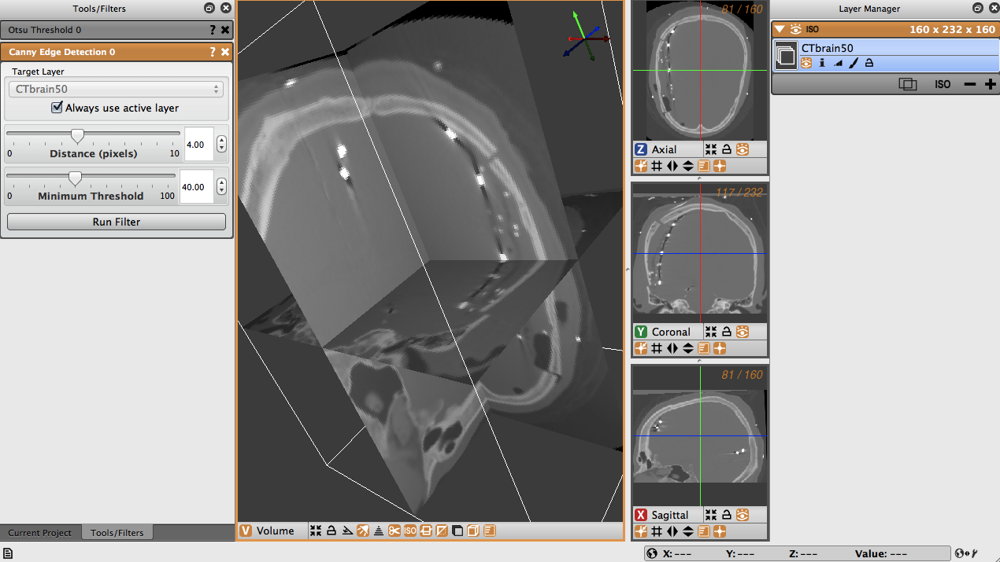

Brain data before Canny edge detection.
:::

The distance is the distance between edges, and the threshold is the pixel intensity threshold for distinguishing edges. Select the distance as 4 and the threshold as 40. When the layer, distance and threshold have been selected, run the filter to create a new layer with the Canny edges displayed ({numref}`fig-canny-after`). Note the detection of edges between dense bone matter and less dense matter.

:::{figure-md} fig-canny-after

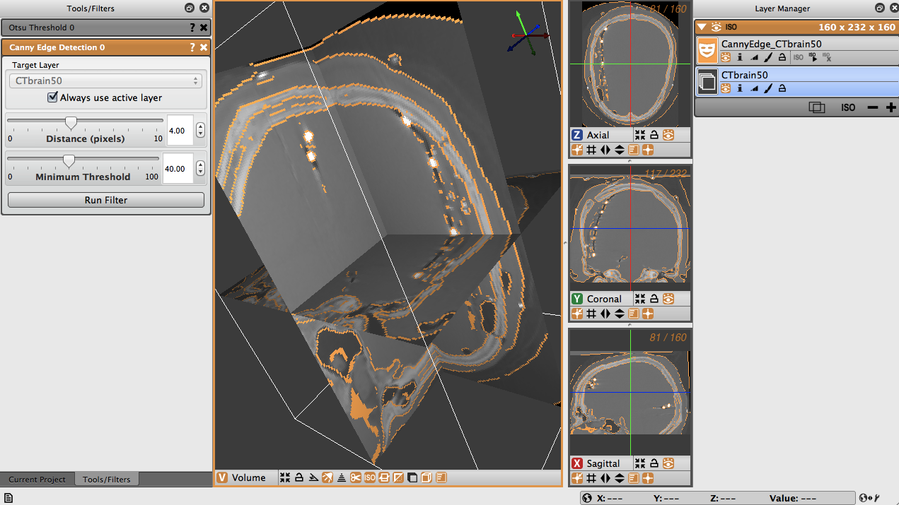

Brain data after Canny edge detection.
:::

#### Canny Edge Detection With Mean Filter

The Canny edge detection filter may also be run by first applying a mean smoothing filter prior to applying the Canny edge detection filter.

:::{figure-md} fig-canny-with-mean-and-layers

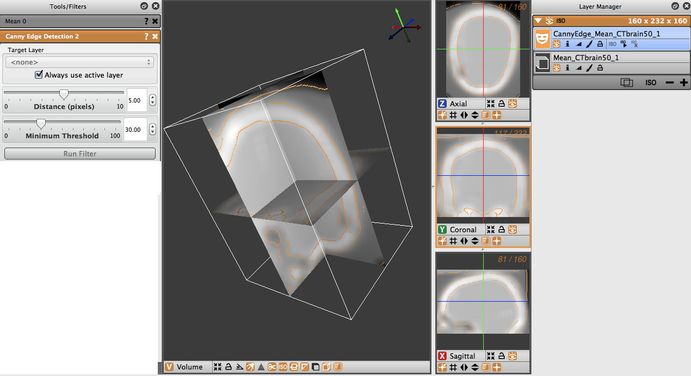

Canny edge detection with mean filter
:::

The image in {numref}`fig-canny-with-mean-and-layers` had a mean filter applied to it with a radius of 6, followed by a Canny edge detection filter with a distance of 5 and a threshold of 30. Notice how smooth the image is prior to the application of the Canny filter.

## Speedline Tool

### Speedline Tool Segmentation

In this example we will use the Speedline Tool (also known as the Live-Wire tool) to segment the left atrium. We start off with the Median Filtered Angiogram defined in the previous chapter. In this example, the data is further smoothed using the Gaussian filter. Using a smoothing filter is recommended before the using Speedline tool.

:::{figure-md} fig-speed-image

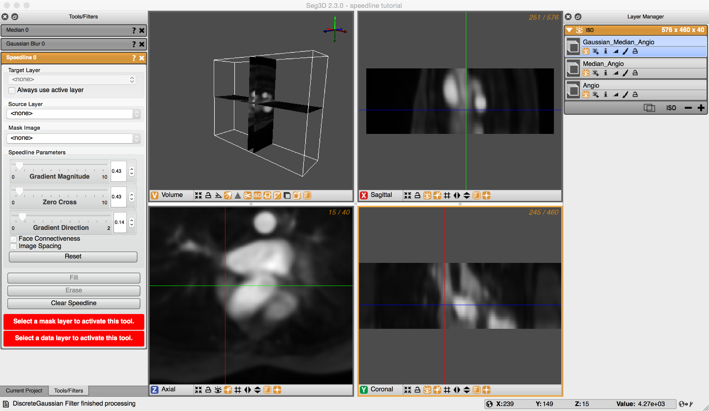

The speed function displaying the gradient of the dataset.
:::

Open the **Speedline** tool from the Tools menu as shown in {numref}`fig-speed-image`. Errors (highlighted in red boxes) are displayed in the **Speedline** dialog box explaining what needs to be done in order to proceed. The first error indicates that a mask needs to be selected in order to create the speedline. Push the plus button on the bottom right corner of the **Layer Manager** on the right of the screen. This will create a new layer mask and eliminate the first error message. Next, a data volume layer must be selected on which to apply the speedline. In the middle of the **Speedline** dialog box on the left of the screen is a drop down menu that has **&lt;none&gt;** selected. Click on the dropdown box and select a data layer.

Now we are ready to create the speedline. Insert a point on the border of the left atrium. Place a second point at some distance from the first and a third point even further away. With the third point in place, hover over a point until you get a hand icon. Now drag this point along the border and the tool will follow the edge of the volume. Add points at the corners and drag the speedline along the left atrial wall. An example of this is shown in {numref}`fig-speed-line1`.

:::{figure-md} fig-speed-line1

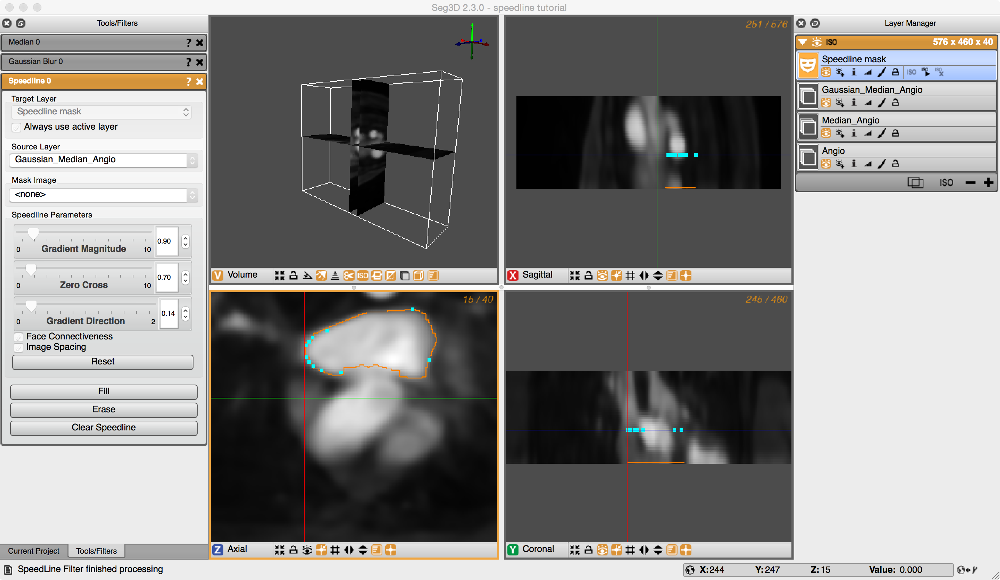

Creating a speedline contour.
:::

Once the speedline has been completed, it can be filled in by hitting **F** or selecting **Fill** from the Tool Menu on the left. Make sure that the label mask you are using does not already have filled regions as the Fill operation will automatically mask over any part that is within the speedline.

Now a segmentation is generated in one slice, proceed to the next slice by press **&lt;** or **&gt;**. The Speedline tool will try to accommodate it’s shape to the new cross section. However, manual corrections can be made by moving points around using the left or right mouse buttons and dragging point around, or by adding additional points by pressing the left mouse button in the center of a segment. Sometimes removing points by pressing the right mouse button over a point will give a better result. Press **F** again to fill in the segmentation. (see {numref}`fig-speed-line2`).

:::{figure-md} fig-speed-line2

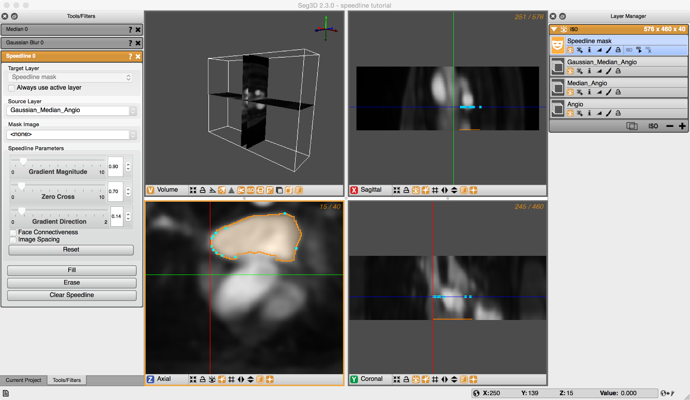

Filling in a speedline contour.
:::

By doing this sequentially for many slices, one can quickly segment a section of a structure. Once a portion of the structure has been segmented, press the **ISO**  button below your selected label mask in the **Layer Manager** window on the right to visualize the results in the 3D.

This concludes the cardiac part of this tutorial. The next chapter will highlight some of the tools using a head dataset.

## Segmenting a Brain Dataset

### Loading Datasets

This part of the tutorial deals with segmenting a head dataset. The data that will be used is that of a 15 year old pediatric patient. This patient underwent surgery during which electrodes were implanted into the brain cavity. The image that we will be using are the MR image that was taken before the surgery and the CT image that was taken after. Note that one can clearly see in the image where the electrodes were inserted.

The final goal of this research is generate a patient specific model which can be used to find focus of brain activity during a seizure. For this a full volumetric representation of the head is needed. In this example we are extracting three tissues, namely the skull, the white matter and the gray matter. The remaining scalp and CSF can be obtained similarly, but is outside the scope of this tutorial.

### Neighborhood Connected

Browse the SCIRunData/Seg3D/Brain\_DataSet directory and load the following two files: CTbrain50.NRRD and MRI-brain50.NRRD. The first one is the post operative CT image and the second one is the pre-surgery MR image. After loading the datasets the Seg3D window should look like the one in {numref}`fig-loading-brain-data-set`.

:::{figure-md} fig-loading-brain-data-set

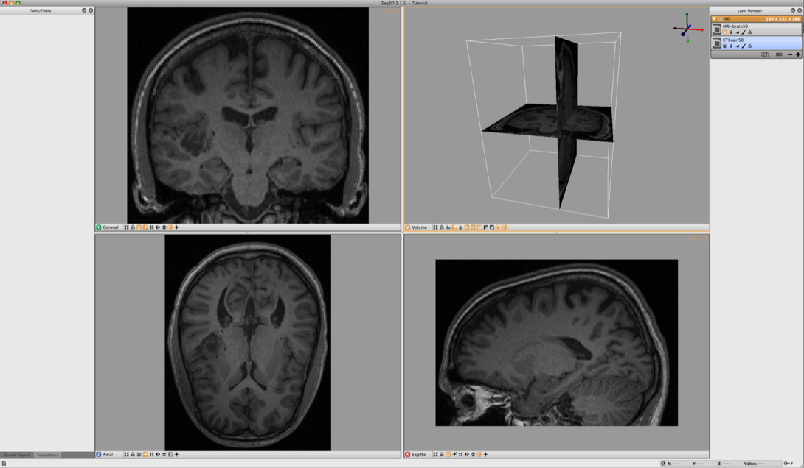

Loading the brain dataset into Seg3D.
:::

Note that the data is not perfectly registered and that a part of the skull has been lifted to actually insert the electrode arrays.

To segment out the Skull we will be using the CT image. Select the CT image in the Layer Menu. Now from the Data Filters menu select the Neighborhood Connected filter. This filter needs seed points and finds every connected tissue of the same gray scale range. Hence placing seed points needs to be carefully. An example of this placement is given in {numref}`fig-neighborhood-connected`.

:::{figure-md} fig-neighborhood-connected

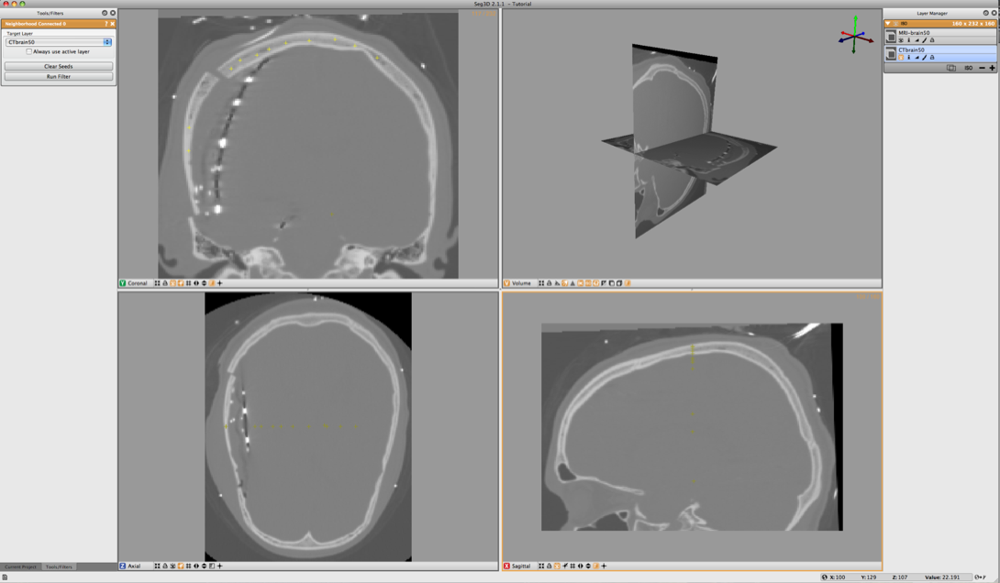

Selecting seed points for Neighborhood Connected filter.
:::

Place the seed points with the left mouse button. While placing the seed points one can scroll to other slices. Each out of plain seed point will be shown less brightly. Place at least 10 seed points or so and then run the filter on the CT image. Be sure to select that one before running the filter.

The result should look like the ones in {numref}`fig-skull-segmentation`. To help understanding the 3D nature of the data, select the newly created label layer and run the isosurface by clicking the create isosurface icon (‘ISO ’) for the layer. This renders the isosurface of the current segmentation.

:::{figure-md} fig-skull-segmentation

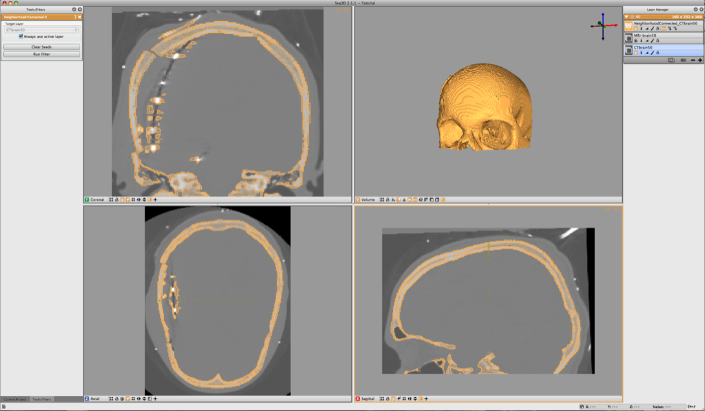

Isosurfacing of Skull Segmentation.
:::

If parts of the skull are still missing, open up the **Neighborhood Connected** filter again and add a few more seed points. Note that all the previous seed points are still there to make it easier to add new points. To clear the seed points hit clear seed points in the filter menu (if needed). To add additional regions just place seed points in those areas. Use the isosurface rendering to check whether the skull is complete. Use the 3D view to see where the slices are and then put seed points where needed.

### Filtering MRI Data

The MR data contents a good data set for segmenting the gray and white matter. However MR images tend to have a bit of noise on them. Often running the data through the median filter will reduce the noise. Select the MR image in the Layer Menu and from the top menu select the **Median Filter** from the Data Filters menu. Run this filter and compare it to the previous MR image.

An easy way to do this is making all layers invisible, by clicking on the eye icons of the individual layers, and then make the original and the filtered MR image visible. Now select the top most image. Now the space bar will toggle between the two images. Navigate through the windows and look at the differences.

A second very useful filter for MR data is the **Intensity Correction Filter** from the Advanced Filters menu. This filter takes a while to run but filters the intensity in the data that have slight gradients due to the distance to the MR coils. The closer the image is to the location of the MR coil, the brighter the images generally are. This filter uses a polynomial model underneath to correct for this. We do this operation to make it easier to threshold the Gray and White Matter.

Apply this filter and again look at the differences. The resulting image is also given in {numref}`fig-median-image-corrected`.

:::{figure-md} fig-median-image-corrected

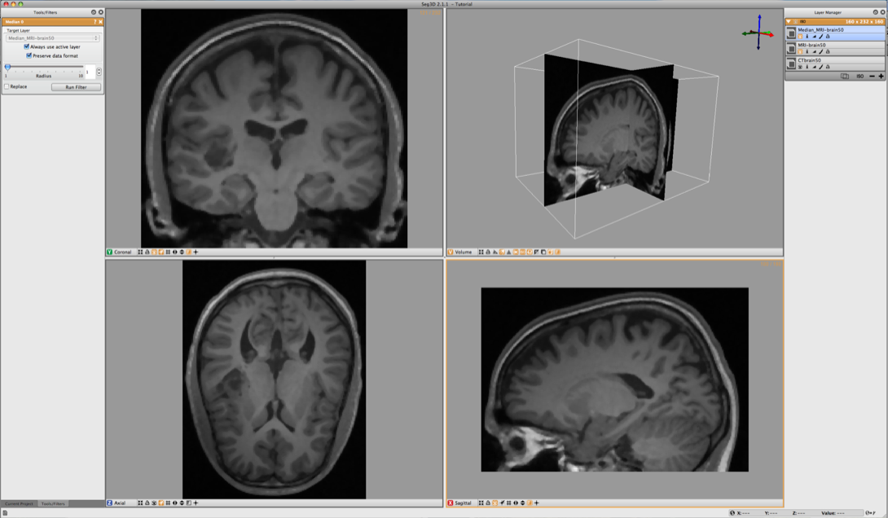

Filtering the brain dataset.
:::

### Masking out Brain

To mask out brain, the easiest is to manually generate a mask and paint with a brush a rough segmentation of the brain cavity. The goal of masking out the data is to be able to threshold the white and gray matter inside the skull without picking up data from the scalp.

To jump start the process a segmentation is available in the dataset. This one was generated by manually painting the slices. Load the label layer through the **Import Layer From Single File...** from the File menu. Choose the Brain.NRRD dataset. Then click on Import file as a **Series of Masks:** There are two of these options and either one is valid because this data file has only one mask layer. After loading the dataset Seg3D should look like the image depicted in {numref}`fig-loading-segmentation`.

:::{figure-md} fig-loading-segmentation

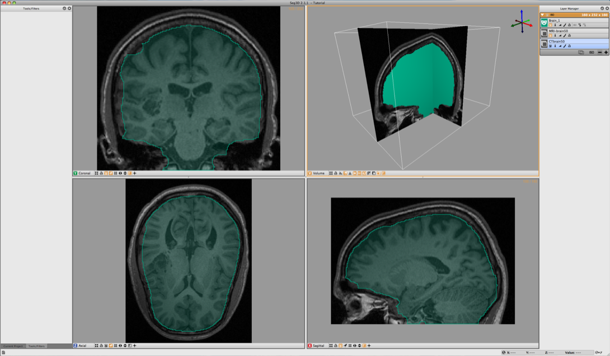

Load a pre-made rough segmentation of the brain.
:::

Now use the **Mask Data** in the Data Filters menu to set the Brain segmentation as a mask. Select the MRI-brain50 for the **Target Layer** and Brain\_1 for the **Mask Layer**. Then click on **Run Filter**. This will create an image where all the scalp and skull are removed and only what is segmented is left as seen in {numref}`fig-mask-data-brain`. This mask will now be used for segmenting the gray and white matter.

:::{figure-md} fig-mask-data-brain

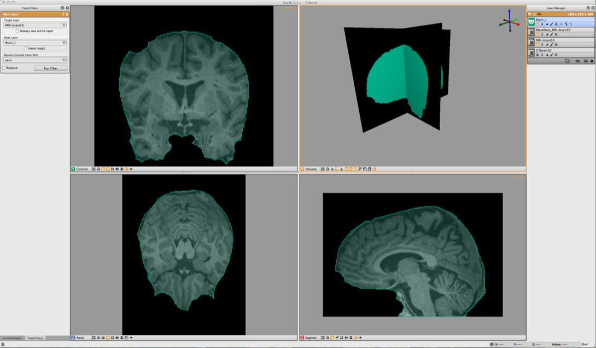

Mask brain data with hand painted segmentation.
:::

### Thresholding Gray and White Matter

To segment the white matter, we select the **Threshold Tool** from the Tools menu. Before using the tool make sure to turn off the Masking layer, by selecting “The Eye” underneath Brain\_1.

Now select the Masked Data Volume. With the **Threshold Tool** insert a few seed points in the white matter. The threshold tool will now segment all the points that are within the range of the seed points. Keep adding points until the white matter has been marked. (see {numref}`fig-threshold-white-matter`). Once the segmentation is good enough press **Create Threshold Layer** in the menu on the left and a new masking layer will be created.

:::{figure-md} fig-threshold-white-matter

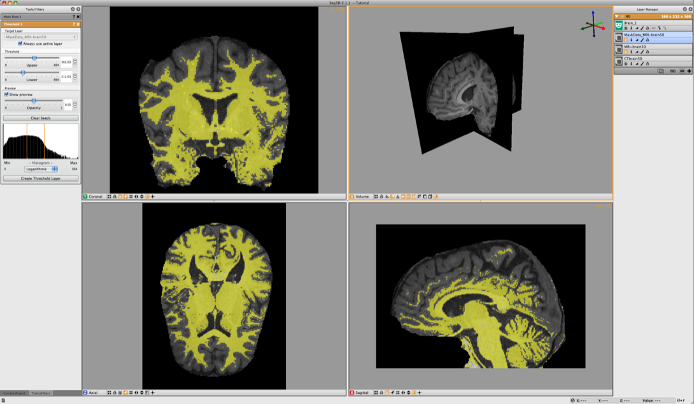

Thresholding white matter using threshold range.
:::

Repeat the same procedure for the gray matter (see {numref}`fig-threshold-grey-matter`). Finally one can use the boolean operators to subtract the white matter from the gray matter. Select **Boolean AND** in the Mask Filters menu. Select one of the masks as the **Target Layer** and the other as the **Mask Layer** and click on **Run Filter**.

:::{figure-md} fig-threshold-grey-matter

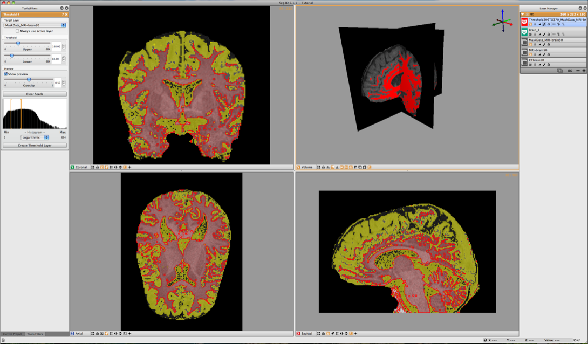

Thresholding grey matter using threshold range.
:::

## Conclusion

This concludes the tutorial. Feel free to explore other structures in the head and make a full segmentation. Please explore the use of the other tools presented in this tutorial and incorporate them into your segmentation strategy if they are useful. Most of the tools and filters not presented utilize a similar structure and are relatively self explanatory; try them out and use them in your project. Contact us at <seg3d@sci.utah.edu> with questions or bug reports and we will try to answer your questions.
