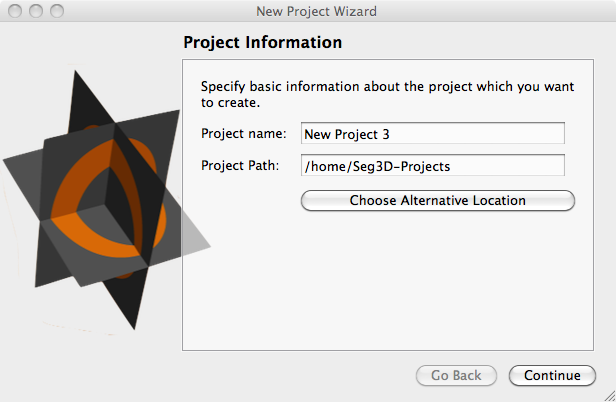
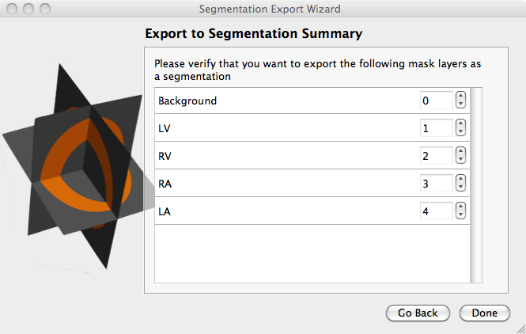

# File

The File tab contains all the features necessary to manage Seg3D projects and files

## New Project

The new project option will prompt you to save your current project such that it can be closed. A dialog box will then open asking for a Project name and a Project Path ({numref}`fig-new-project`). The Project name will be used to create a folder for all the project data. The Project path defines the location of this folder, which can be set by typing the path or through a separate dialogue box by pressing ’Choose Alternate Location’. The default location for this path can be set in the preferences section discussed below. A new project can also be created using the shortcut CTRL/CMD+N.

:::{figure-md} fig-new-project

Project Information window is shown when a new project option is chosen. The project name and location are set in this window.
:::

## Open Project

The open project selection will prompt you to save you current project and open a new project based by selecting it from a file menu. This function can be called using the shortcut CTRL/CMD+O.

## Show Project Folder

This option will open a file menu showing the projects contained in your default project location. This function can be called using the shortcut Shift+CTRL/CMD+O. The default project location can be changed in Seg3D preferences.

## Save Project

If the project as already been given a name and location, this will save the project. If the project has not yet been named, it will prompt the user for a project name and location. This function can be called using the shortcut CTRL/CMD+S.

## Save Project As

This will create a copy of the current project under a new name and project location. This function can be called using the shortcut Shift+CTRL/CMD+S.

## Launch Another Copy of Seg3D

This opens a new session of Seg3D. It does not close the current session, but simply opens another copy.

## Import Layer From Single File

Data and label maps can be stored in a variety of file formats. Use this option when the data or label map is stored in one single file. This function can be called using the shortcut Shift+CTRL/CMD+O.

### Import Widget

After the user selects the file/files to be read, a menu will appear asking the user to define the type of data being read as seen below ({numref}`fig-import-widget`).

:::{figure-md} fig-import-widget

When importing data or label masks, the user is prompted to define the type of data being read.
:::

There are two types of files that can be read by Seg3D: Image data and label maps. The first selection indicates that the file you wish to read in contains image data. The next three selections all apply to label maps. The second selection assumes that all non-zero values are part of a single label map. The third selection will define each unique value in the file as part of a separate label map. However, the numerical value assigned to represent that label will be incrementally generated by Seg3D rather than assigned from the input file. The fourth selection is similar to the third in that it creates labels based on unique values in the input file. However, in this case the value used to represent the label is the same as the value being read from the file.

## Import Layer From Image Series

Data and label maps can be stored in a variety of file formats. Use this option when the data or label map is stored in multiple files. See Import Layer From Single File for more information about the Import Widget. This function can be called using the shortcut Shift+CTRL/CMD+I.

## Export Segmentation

Label maps can be exported in a variety of file formats. If a layer containing a label map is selected, then the user may select the Export Segmentation option which opens the segmentation dialogue ({numref}`fig-export-seg`).

:::{figure-md} fig-export-seg

This window appears when the user selects export segmentation.  It allows the user to select the layers they wish to export as label masks and the format they wish to export.
:::

This window allows the user to select the layers to export as label masks and the format they wish to export. The available formats include: .nrrd, .mat (matlab), .tiff, .bmp, .png, .dcm. This function can be called using the shortcut CTRL/CMD+E. The segmentation may be saved as a single file or as multiple files.

After choosing a file name (single file only) and location for the segmentation, you will be shown the Export to Segmentation Summary. This window shows the layers chosen to save as a segmentation. In the case of saving as a single file, there is an additional layer (the background, which is the remainder of the volume) and an option to choose the value to represent each of the layers ({numref}`fig-export-seg2`). It should be noted that the segmentation will only represent one value per voxel, so if any of the selected layers overlap the higher value will overwrite the region of overlap. If saving as multiple files, this window will show the names of the layers only.

:::{figure-md} fig-export-seg2

This window appears when the user selects export segmentation and a file is chosen.  This allows the users to choose the labels to use for each material.
:::

## Export Active Data Layer

If image data layer is selected, then the user may choose to Export Active Data Layer. This selection opens a file menu window where the user can select the location they wish to save the data file as well as specify the file format. The available formats include: .nrrd, .dcm, .tiff, .png, .mrc, and .mat (matlab). This function can be called using the shortcut Shift+CTRL/CMD+E.

## Recent Projects

This menu shows recently opened projects. These projects can be opened quickly by clicking on the name of the project.
