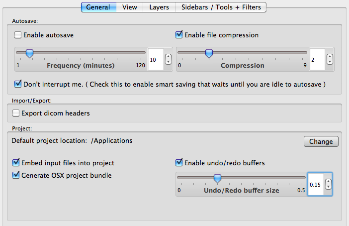
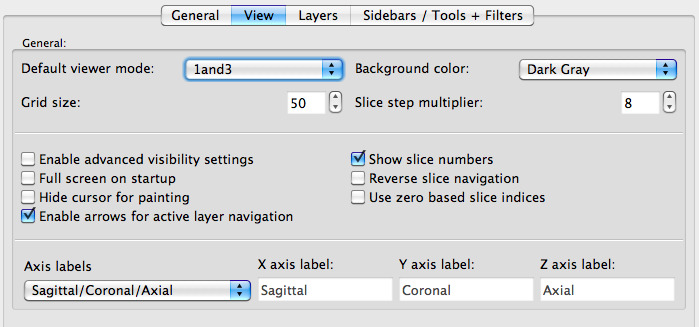
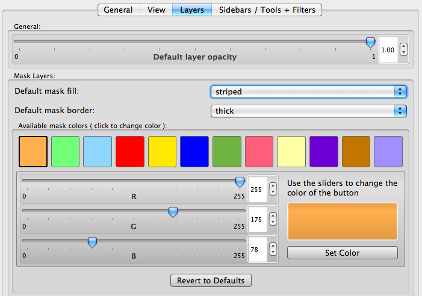
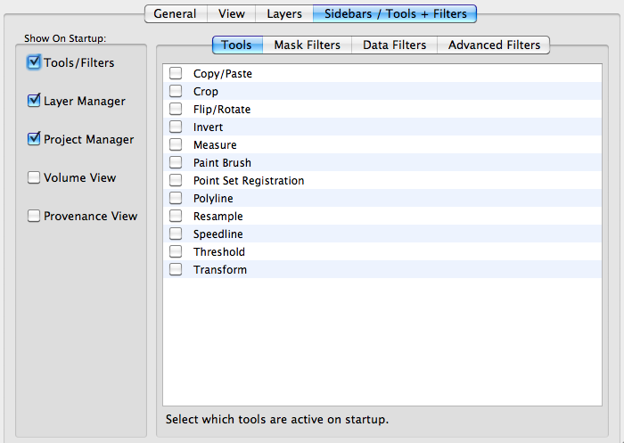

# Preferences

The preference dialogue box can be opened by selecting **Seg3D** ⇒ **Preferences** on Mac OS X. This dialog box contains four tabs which we will discuss here.

## General

The in Seg3D preferences, the general tab allows you to change many details of the “autosave” options. The user may turn on the autosave feature and set a frequency for which the project is save. The “Don’t interrupt me” option can be turned on so that the auto save does not happen while another operation is being performed. Along with the frequency the amount of compression used to save each project can be controlled in this tab.

The **Import/Export** options allows you to turn on an off a feature that will export a dicom header with all dicoms that are exported.

The **Project** options allow you to change the default project location, change the buffer size, and change how the project is saved e.g. change if the input files are embedded into the project.

:::{figure-md} fig-pref-gen

The Seg3d preferences under the general tab.
:::

## View

Under this tab the user is able to change many of the default view options such as the window layout (1 big window with 3 smaller windows), background color, and Grid size. In addition there are many options to customize what is seen in the visualization window. At the bottom of this window the user can change the axis labels such that the X, Y, and Z directions are not fixed to represent Sagittal, Coronal, and Axial, but the user can define which axis label is assigned to each direction.

:::{figure-md} fig-pref-view

The Seg3d preferences under the view tab.
:::

## Layers

Under this tab the user can change the appearance of the label masks. These options include: layer opacity, available colors, mask fill option (striped or solid), and border thickness.

:::{figure-md} fig-pref-layers

The Seg3d preferences under the layers tab
:::

## Sidebars/Tools + Filters

Under this tab the user can select which menus appear on start up and which tools/filters will appear in the sidebars. This intended for the user to customize their user interface to improve the ease of use.

:::{figure-md} fig-pref-side

The Seg3d preferences under the sidebars/tools + filters tab.
:::
