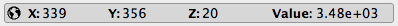
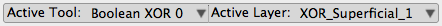

# Tool Bar

The tool bar located at the bottom of the Seg3D window contains some useful functions. The first is the message history icon on the left side of the tool bar ({numref}`table-tool-bottom-icons`). For more information on this window, see [MessageHistoryWindow](../Seg3DWindows/MessageHistoryWindow.md). The other use function is on the right side of the tool bar, the information tool bar. This tool bar can switch between displaying information about the active layer at the mouse location and a quick menu for the active layers by clicking on the switch tool button ({numref}`table-tool-bottom-icons`).

```{list-table} Icons and Actions in the Tool Bar at the Bottom of Seg3D
:name: table-tool-bottom-icons
:widths: 10 90
:width: 100%
:header-rows: 1

* - Icon
  - Function

* - ```{image} ../../Seg3DBasicFunctionality_figures/TextOff.png
    ```
  - Message History Icon: Opens Message History window.

* - ```{image} ../../Seg3DBasicFunctionality_figures/SwitchTool.png
    ```
  - Switch Tool Icon: Switches between displaying location of mouse in the volume and the quick menu to switch between the active tools and layers.

* - ```{image} ../../Seg3DBasicFunctionality_figures/WorldOff.png
    ```
  - World Icon: Switches between coordinate system displayed in the information tool bar. The options are relative (indexed) and absolute (world).

```

The information toolbar will show information about the volume at the location indicated by the mouse. As shown in {numref}`fig-geometric-info`, the information given is the x, y, and z coordinates and the value of the layer at the mouse position in the selected volume. By clicking on the world icon ({numref}`table-tool-bottom-icons`), you may toggle between indexed values (relative) and the world values (absolute, considers spacing). The data shown is changed when the mouse is moved, the active slice is changed, or the active layer is changed.

:::{figure-md} fig-geometric-info



Geometric Information shown in the information tool bar.
:::

By clicking on the switch tool icon ({numref}`table-tool-bottom-icons`), the tool bar will display a quick menu for the available tools and layers instead of geometric information. As seen in {numref}`table-tool-bottom-icons`, this menu will display the active tool and layer. If the either is clicked, a dropped down menu will appear allowing the user to switch to an open tool or layer. This can be especially useful in full screen mode.

:::{figure-md} fig-quick-menu



Quick menu shown in the information tool bar.
:::
