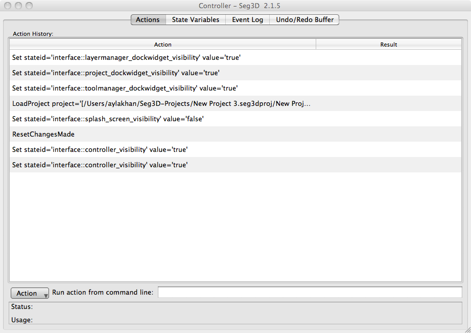
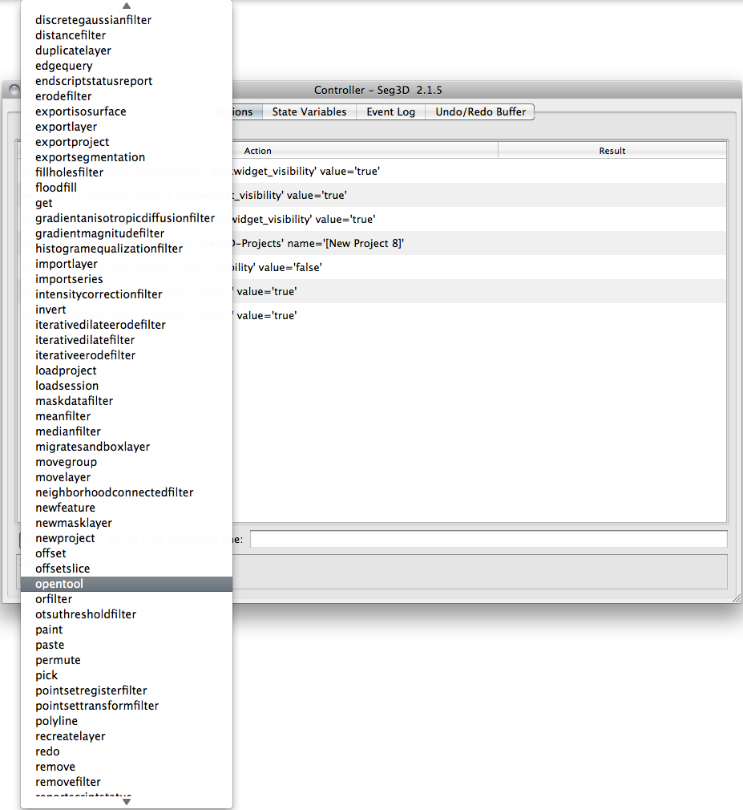
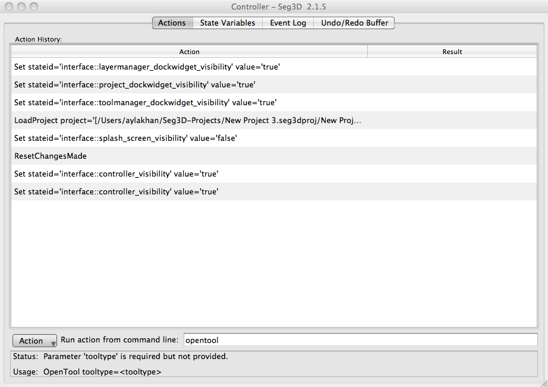

# Actions Tab

The Actions tab displays all of the actions that have been taken during the Seg3D session. Console entries can also be made with this feature.

*Controller Window on initial open.*

A series of actions area provided in a drop-down menu at the bottom of the window (<a href="#ControllerActionList">Figure 4.10</a>). Once selected, the action will be placed into a command line to the right of the drop-down menu.

*Controller Window action list.*

The user can then define the parameters for the action, or simply press enter to see what parameters are required to make the action valid. If additional parameters are needed to run the action, they will be displayed in a message in the box below the command line (<a href="#UsabilityMsg">Figure 4.11</a>).

*Action usability message.*
