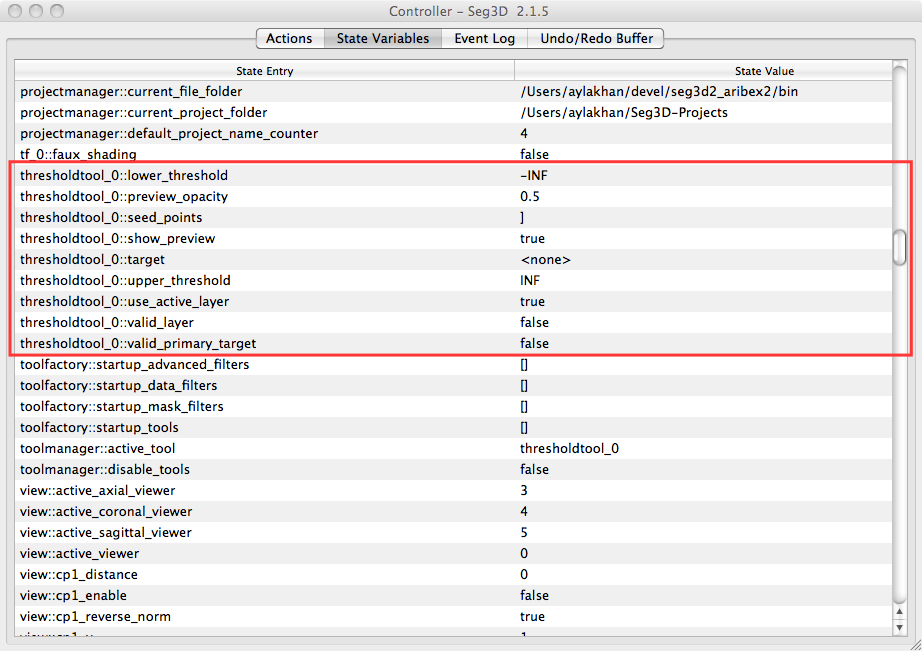

# State Variables Tab

The state variables tab shows a list of all the state settings for the session. Settings cannot be edited in this window, instead use the built-in get and set functions . The state variables include Seg3D viewer settings, tool and filter arguments and settings. For example, {numref}`fig-tool-state-vars` shows Threshold tool state variables.

:::{figure-md} fig-tool-state-vars

Threshold tool state variables.
:::
