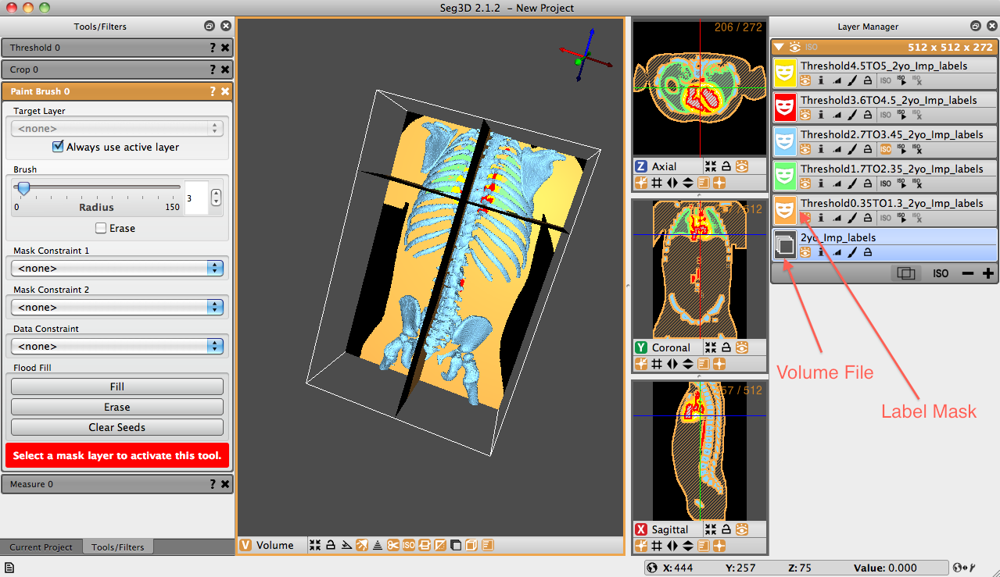

# Layer Manager Window

The layer manager window is the last of the three windows that open by default upon launching Seg3D. This window is positioned to the right side of the Seg3D window pane and contains all of the mask and volume files involved with the session. If a file is not selected when Seg3D launches, this window will be blank, otherwise it will contain the volume and mask surface files associated with the opened file.


<figcaption>Layer Manager Window</figcaption>

The layer manager window is the last of the three windows that open by default upon launching Seg3D. This window is positioned to the right side of the Seg3D window pane and contains all of the mask and volume files involved with the session. If a file is not selected when Seg3D launches, this window will be blank, otherwise it will contain the volume and mask surface files associated with the opened file.

A volume file is represented by a gray image with multiple stacked planes. A label mask is represented by a colored icon with a white mask in the middle. The colors correspond to the label masks seen in the viewer windows. Names of label masks are, by default, a conglomeration of the tools applied to the original volume. For example, in the image above, five label masks have been created from the volume file ’`2yo_Imp_labels`.’ The uppermost mask (in yellow) has the name ’`Threshold4.5TO5_2yo_Imp_labels`.’ This name was generated because the threshold tool, with values between 4.5 and 5, was applied to the original volume file. If another tool were to be applied on the yellow mask, the new mask would state the name of the tool, followed by the complete name of the yellow label mask. Names of masks can be manually changed by clicking the current name and typing in the desired text.

```eval_rst
.. |VisibleOff| image:: ../../Seg3DBasicFunctionality_figures/VisibleOff.png
   :width: 20pt
   :height: 20pt
.. |InfoOff| image:: ../../Seg3DBasicFunctionality_figures/InfoOff.png
   :width: 20pt
   :height: 20pt
.. |OpacityOff| image:: ../../Seg3DBasicFunctionality_figures/OpacityOff.png
   :width: 20pt
   :height: 20pt
.. |AppearanceOff| image:: ../../Seg3DBasicFunctionality_figures/AppearanceOff.png
   :width: 20pt
   :height: 20pt
.. |LockOff| image:: ../../Seg3DBasicFunctionality_figures/LockOff.png
   :width: 20pt
   :height: 20pt
.. |IsosurfaceVisibleOff| image:: ../../Seg3DBasicFunctionality_figures/IsosurfaceVisibleOff.png
   :width: 20pt
   :height: 20pt
.. |IsosurfaceComputeOff| image:: ../../Seg3DBasicFunctionality_figures/IsosurfaceComputeOff.png
   :width: 20pt
   :height: 20pt
.. |IsosurfaceDeleteOff| image:: ../../Seg3DBasicFunctionality_figures/IsosurfaceDeleteOff.png
   :width: 20pt
   :height: 20pt

+------------------------+--------------------------------------------------------------------------------------------------------------------------------------------------------------------+
| Icon                   | Function                                                                                                                                                           |
+========================+====================================================================================================================================================================+
| |VisibleOff|           | Visible Icon: The eye icon displays the current mask. When the eye is highlighted the mask is visible in the view plane, when it is not, the mask is ’turned off.’ |
+------------------------+--------------------------------------------------------------------------------------------------------------------------------------------------------------------+
| |InfoOff|              | Info Icon: The ’i’ icon displays information about the layer.                                                                                                      |
+------------------------+--------------------------------------------------------------------------------------------------------------------------------------------------------------------+
| |OpacityOff|           | Opacity Icon: The histogram-looking icon allows the user to change opacity levels of the layer.                                                                    |
+------------------------+--------------------------------------------------------------------------------------------------------------------------------------------------------------------+
| |AppearanceOff|        | Appearance Icon: The paintbrush-like icon allows the user to change th layer’s appearance.                                                                         |
+------------------------+--------------------------------------------------------------------------------------------------------------------------------------------------------------------+
| |LockOff|              | Lock Icon: The lock icon allows users to lock the layer to further editing.                                                                                        |
+------------------------+--------------------------------------------------------------------------------------------------------------------------------------------------------------------+
| |IsosurfaceVisibleOff| | Isosurface Visible Icon: This icon toggles visibility of the layers isosurface. Isosurfaces must be computed first.                                                |
+------------------------+--------------------------------------------------------------------------------------------------------------------------------------------------------------------+
| |IsosurfaceComputeOff| | Isosurface Compute Icon: This icon generates the isosurface for the mask. It must be clicked before the IsosurfaceMenu or IsosurfaceDelete icons become active.    |
+------------------------+--------------------------------------------------------------------------------------------------------------------------------------------------------------------+
| |IsosurfaceDeleteOff|  | IsosurfaceDelete Icon: This icon deletes active isosurfaces (if the mask has one).                                                                                 |
+------------------------+--------------------------------------------------------------------------------------------------------------------------------------------------------------------+
|                        | Shift+Left Button Drag Layer: This moves a layer from one group to another with resampling.                                                                        |
+------------------------+--------------------------------------------------------------------------------------------------------------------------------------------------------------------+
```
<figcaption>List of icons and actions available for each layer.</figcaption>

Each volume or mask label has standard, associated icons below their names. The above table displays and describes each of these icons. These icons represent tools that are available for each individual layer.

```eval_rst
.. |DownArrow| image:: ../../Seg3DBasicFunctionality_figures/DownArrow.png
   :width: 20pt
   :height: 20pt
.. |VisibleOff| image:: ../../Seg3DBasicFunctionality_figures/VisibleOff.png
   :width: 20pt
   :height: 20pt
.. |IsosurfaceVisibleOff| image:: ../../Seg3DBasicFunctionality_figures/IsosurfaceVisibleOff.png
   :width: 20pt
   :height: 20pt

+------------------------+---------------------------------------------------------------------------------------------------------------------------------------------------------------------------------------------------------------------------------------------------------------------+
| Icon                   | Function                                                                                                                                                                                                                                                            |
+========================+=====================================================================================================================================================================================================================================================================+
| |DownArrow|            | Expanded Layer Group Icon: This icon indicates that the layer group is visible, showing all the layers in it. The layer group can be collapsed, and expanded again by clicking on this icon. This turns into a right arrow when collapsed.                          |
+------------------------+---------------------------------------------------------------------------------------------------------------------------------------------------------------------------------------------------------------------------------------------------------------------+
| |VisibleOff|           | Visible Icon: This icon will toggle the visibility of all the layers in the group. If some of the layers are not visible, this icon will make those layers visible so that all the layers are visible. If all layers are visible, this will turn off visibility.    |
+------------------------+---------------------------------------------------------------------------------------------------------------------------------------------------------------------------------------------------------------------------------------------------------------------+
| |IsosurfaceVisibleOff| | Isosurface Visibile Icon: This icon toggles visibility of all computed isosurfaces in the layer group. If there are computed isosurfaces that are not visible, this icon will make those visible. If all computed Isosurfaces are visible, this will hide them all. |
+------------------------+---------------------------------------------------------------------------------------------------------------------------------------------------------------------------------------------------------------------------------------------------------------------+
```
<figcaption>List of icons and actions available at the top of each layer group.</figcaption>

Layers in Seg3D are arranged into layer groups. Layer groups are formed with layers that have the same geometric information, that is the same origin, spacing, and size. Groups are separated by panels with an orange header. Generally speaking, most tools and filters requiring more than one input can only operate on layers in the same group (and therefore the same grid geometry).

```eval_rst
.. |DuplicateOff| image:: ../../Seg3DBasicFunctionality_figures/DuplicateOff.png
   :width: 20pt
   :height: 20pt
.. |IsosurfaceMenuOff| image:: ../../Seg3DBasicFunctionality_figures/IsosurfaceMenuOff.png
   :width: 20pt
   :height: 20pt
.. |Minus| image:: ../../Seg3DBasicFunctionality_figures/Minus.png
   :width: 20pt
   :height: 20pt
.. |Add| image:: ../../Seg3DBasicFunctionality_figures/Add.png
   :width: 20pt
   :height: 20pt

+---------------------+----------------------------------------------------------------------------------------------------------------------------------------------------------------------------------------------------------------------------------------------------------------------------------------------------+
| Icon                | Function                                                                                                                                                                                                                                                                                           |
+=====================+====================================================================================================================================================================================================================================================================================================+
| |DuplicateOff|      | Duplicate Layer Icon: This icon allows the user to duplicate one or more layers. Once this icon is clicked, the user will be prompted to choose the layers to duplicate by checking the boxes next to the layers. The duplicated layers will have the same name with “copy” appended to the front. |
+---------------------+----------------------------------------------------------------------------------------------------------------------------------------------------------------------------------------------------------------------------------------------------------------------------------------------------+
| |IsosurfaceMenuOff| | Isosurface Menu Icon: This icon will open a menu that allows the user to change some of the isosurface rendering parameters for all the isosurfaces in the layer group. These parameters are the quality and capping of the isosurface.                                                            |
+---------------------+----------------------------------------------------------------------------------------------------------------------------------------------------------------------------------------------------------------------------------------------------------------------------------------------------+
| |Minus|             | Delete Layer Icon: This icon allows the user to delete one or more layer from the layer group. When the icon is clicked, the user will be prompted to choose the layers to delete by clicking the box next to the layer. There will be a confirmation window after the selection is made.          |
+---------------------+----------------------------------------------------------------------------------------------------------------------------------------------------------------------------------------------------------------------------------------------------------------------------------------------------+
| |Add|               | New Layer Icon: This icon will create a new mask layer that is the same size as those in the layer group but will be empty.                                                                                                                                                                        |
+---------------------+----------------------------------------------------------------------------------------------------------------------------------------------------------------------------------------------------------------------------------------------------------------------------------------------------+
```
<figcaption>List of icons and actions available at the bottom of each layer group.</figcaption>

There are some functions that are operated as a group. These are indicated by the icons on the top of the pane, in the orange bar. Additionally, there are some other icons at the bottom of the group that control some of the group functions. Hovering the cursor over the icon will display the the use of each additional icon.
