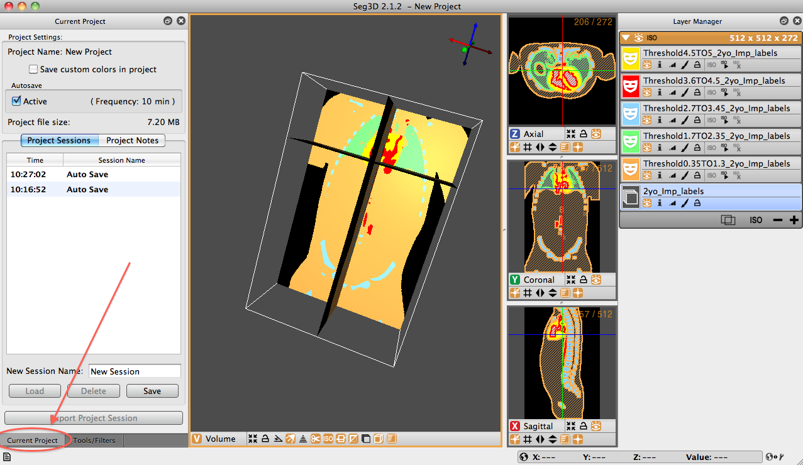

# Project Window

:::{figure-md} fig-project-window

Project Window
:::

The project window is one of three windows that is opened by default when Seg3D launches. It is located on the left side of the panel and is secondary to the default ’Tools Window’ which is also located on the left but appears over top of the project window. In order to access the window, simply click the tab at the bottom of the left side named ’Current Project’ (see {numref}`fig-project-window`) or go to the ’Window’ drop down menu, de-select ’Project Window’ and reselect it.

Now you come to the ’Current Project’ window. The window is divided into two panes. At the top of the window is the Project Settings pane. The name of the current project is listed. Below this is the option to ’Save custom colors in project.’ This option allows the user to keep the defined colors assigned to specific label masks within the project. Below this is an ’Autosave’ option. Seg3D autosaves sessions every 10 minutes by default. The default time between autosaves can be changed in the general Seg3D preferences.

The second pane holds the ’Project Sessions’ and ’Project Notes’ panels. The project session contains information on the saving of various sessions throughout the work-time in Seg3D - including autosaves. These session saves can be selected and loaded at any time. Loading a session save does not delete saves that came later. To delete, the user must explicitly select the session and push the delete button at the bottom of the pane. Additional sessions may also be saved with user specified names. The second panel of this pane (the ’Project Notes’ panel) allows the user to write notes to along the way.

At any time the user can export the session to a new location - with or without a different name than the original session by clicking the ’Export the Project Session button on the bottom of the ’Current Project’ window.
