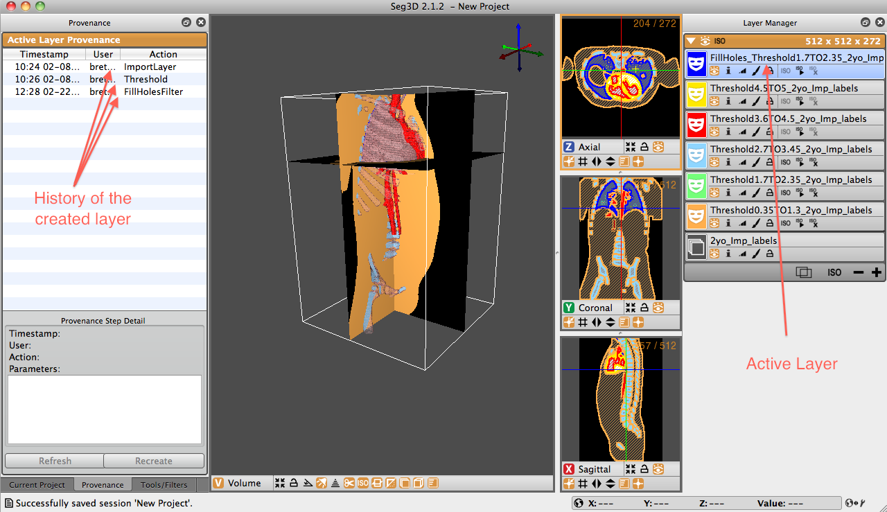

# Provenance Window

The Provenance Window is not opened by default when Seg3D is opened. To open the window, click the ’Window’ option in the task bar and select the Provenance option. The window may also be toggled by using the key command: Shift+CTRL/CMD+H. When the window opens, it will appear on the left side of the Seg3D user interface over top of the ’Current Project’ panel and the ’Tools’ panel.

The Provenance Window shows the history of the active layer. In order to see which actions lead to the current layer, highlight the layer in the ’Layer Window’ on the left of the Seg3D display. Initially, nothing will appear in the Provenance window. Click the Refresh button at the bottom of the panel and the complete history of that mask will appear.

:::{figure-md} fig-provenance-window

Volume View Window - Clipping Panel Displayed. Show clipping option at the bottom of the viewer window is activated by default.
:::

For example, {numref}`fig-provenance-window` shows an example of a ’FillHoles’ Layer. This layer was was generated by applying a FillHoles tool to the thresholded mask of the lungs. As can be seen in the Provenance panel, the first step in creating this mask was to Import the volume layer. Next, a threshold was taken. Last, the FillHolesFilter was applied to the Threshold mask. By selecting one of the steps in the Provenance window, the parameters defining that portion of the mask history will be shown. For example, by selecting the Threshold option, the thresholding range will be displayed.
