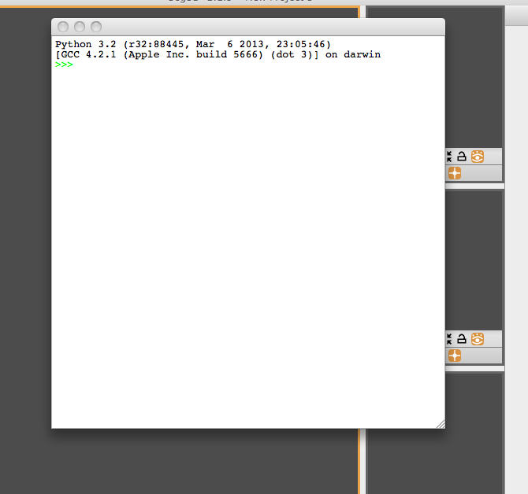

# Python Console

The Python Console window is not opened by default when Seg3D is opened. To open the window, click the ’Window’ option in the task bar and select the Python option. The window may also be toggled by using the key command: Shift+CTRL/CMD+Y. Notice the Python Window option in the window drop-down menu is located below a separator. This indicates that the window will open a new pop-up window outside of the general Seg3D user interface.

The Python Window opens a Python scripting console that can be used by advanced users to control Seg3D ({numref}`fig-python-console`). Python code wrappers are generated allowing tools, filters, the viewer and data to be controlled in Python scripts. Basic Seg3D Python code samples are available under [Python Code Snippets](../../../../py_docs/python). An extensive treatment of python coding will not be attempted in this document; for more information on python coding, consult other resources.

:::{figure-md} fig-python-console

Python Console Window
:::
