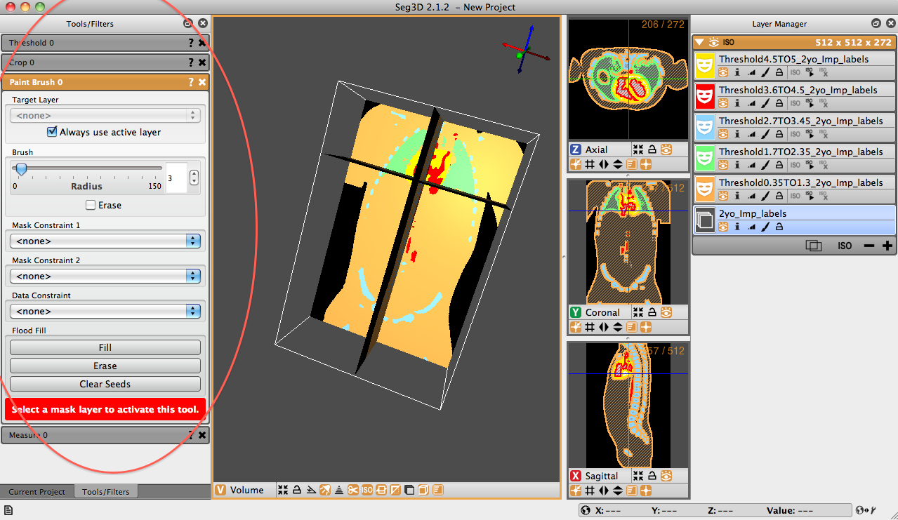

# Tools Window

The tools window is another of the three windows that is opened upon Seg3D launch. This window is also on the left of the Seg3D panel and is, unlike the project window, is displayed when Seg3D is opened. Users can toggle between project and tool windows by selecting the specific tabs at the bottom of the left most window pane.

The tool window houses the current tools that the user has selected from the ’Tools’ drop down menu. The active tool will be highlighted in orange and will be displayed. Inactive tools, that have been opened during the session, will be grayed out and minimized. To access one of the other tools, click one of the grayed out items or select it from the ’Tools’ drop down menu. In {numref}`fig-tool-window`, the ’Paint Brush’ tool is active, while the ’Threshold,’ ’Crop,’ and ’Measure’ tools are inactive.

:::{figure-md} fig-tool-window

Tools Window
:::
