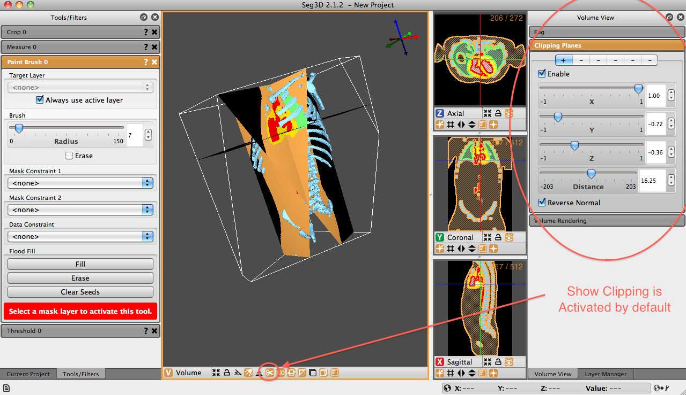

# Clipping Planes Panel

The Clipping Planes Panel allows users to define multiple clipping planes with which to clip the volume. + and - signs at the top of the panel represent individual clipping planes. The + sign is an enabled clipping plan, while the - sign is disabled. The clipping panel option in the viewer window is activated by default.

:::{figure-md} fig-clipping-panel

Volume View Window - Clipping Panel Displayed. Show clipping option at the bottom of the viewer window is activated by default.
:::

Once an clipping plane has been selected, it must be enabled. Click the ’Enable’ checkbox. After the plane is enabled, the user is able to define the influence of each cardinal direction on the plane. The number 1 in a box indicates that the clipping plane will slice a 45-degree angle within the positive side of that cardinal direction on the 3d viewing window. A -1 will clip a -45-degree angle from the negative side.

In order to activate a clip from any cardinal direction, the user must click the slider associated with the desired plane. If the slider is not clicked, no clipping will take place...even with the clipping plane enabled. If, say, the z slider is not clicked, no clipping will occur in that plane. Combining these directional clips allows the user to define a plane that is tipped and tilted in any 3-dimensional direction. A fourth slider option, the Distance slider, allows the user to define how the position of the clipping plane with respect to the volume. If the distance slider is set all the way to the left, no image will be displayed (it will be completely clipped). If it is set to the right, the entire image will be displayed (no clipping is applied). Anything in between will show some clipping of the image.

The final option in the Clipping Planes panel is the option to ’Reverse Normal.’ This option allows the user to reflect the clipping plane. That is, if the image is clipped within the positive XY plane, the ’Reverse Normal’ option will display the clip within the negative XY plane {numref}`fig-clipping-panel` shows the result of a clipping plane applied in all three cardinal directions.
