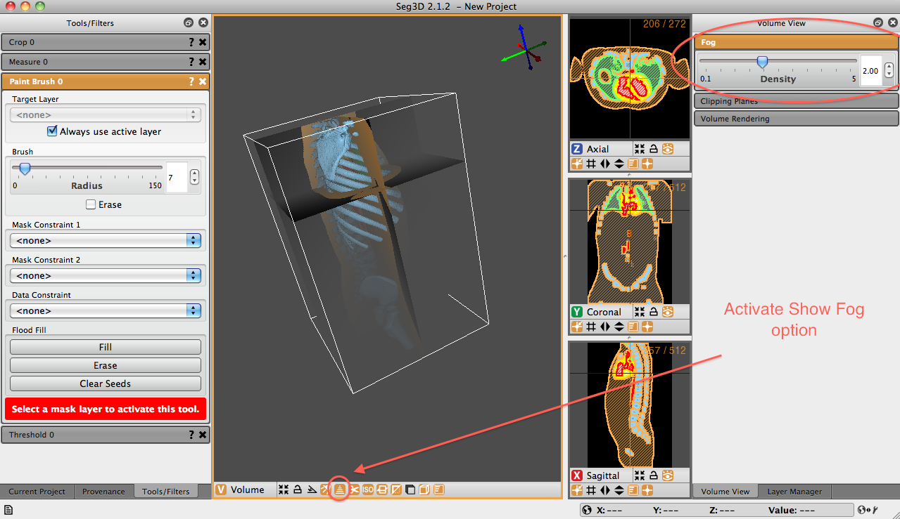

# Fog Panel

The Fog Panel allows the user to control the fog density. In order to observe the effects of fog, the user must activate the Show fog icon on the bottom of the 3D viewer window. Once active, a fog will be observed on the image. The depth of the fog is determined by the distance that the 3-dimensional component is away from the viewer. In {numref}`fig-fog-panel`, the pelvis is tilted away from the viewer. It is therefore farther from the viewer and has more fog effect applied to it.

Fog density can be tuned by using the slider in the the Volume View Window. By default the density value is 1.00. If the fog density increases, the fogging effect increases.

:::{figure-md} fig-fog-panel

Volume View Window - Fog Panel Displayed. The user must activate the Show fog option at the bottom of the viewer window.
:::
