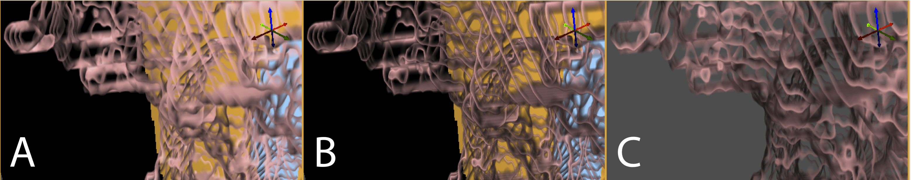

# Rendering Options

With these two options selected, the user now has three rendering options. These options are Simple, Faux Shading, and Ambient Occlusion.

:::{figure-md} fig-vol-rend-opt

Volume Rendering Options - A) Simple B) Faux Shading C) Ambient Occlusion
:::

## Simple

The simple rendering strategy gives the user the option to select the Sapling Rate. The higher the rate, the more accurate the representation of the selected region. An option in the ’Transfer Function’ section of the pane that allows the user to choose ’Solid’ transfer function representation changes the appearance by coloring each selected slice to a solid color. More on this feature will be addressed below. Note that the images in {numref}`fig-vol-rend-opt` do not have the solid option selected.

## Faux Shading

Faux Shading is the same as the simple rendering option with the exception that a simple shading is added to the visible volume. Where the simple rendering fades regions of the slice to clear (where the ’Solid’ transfer function option is NOT selected), the Faux Shading options fade slices to a grayer hue, dependent on where it sits from other 3-dimensionally viewed volumes. If the ’Solid’ feature is selected, the Simple and Faux Shading rendering are the same.

## Ambient Occlusion

Ambient Occlusion has several additional options. In addition to the sampling rate, an occlusion angle (range: 0 to 80 degrees) and a sample resolution (range: 1 to 10) are now available.
