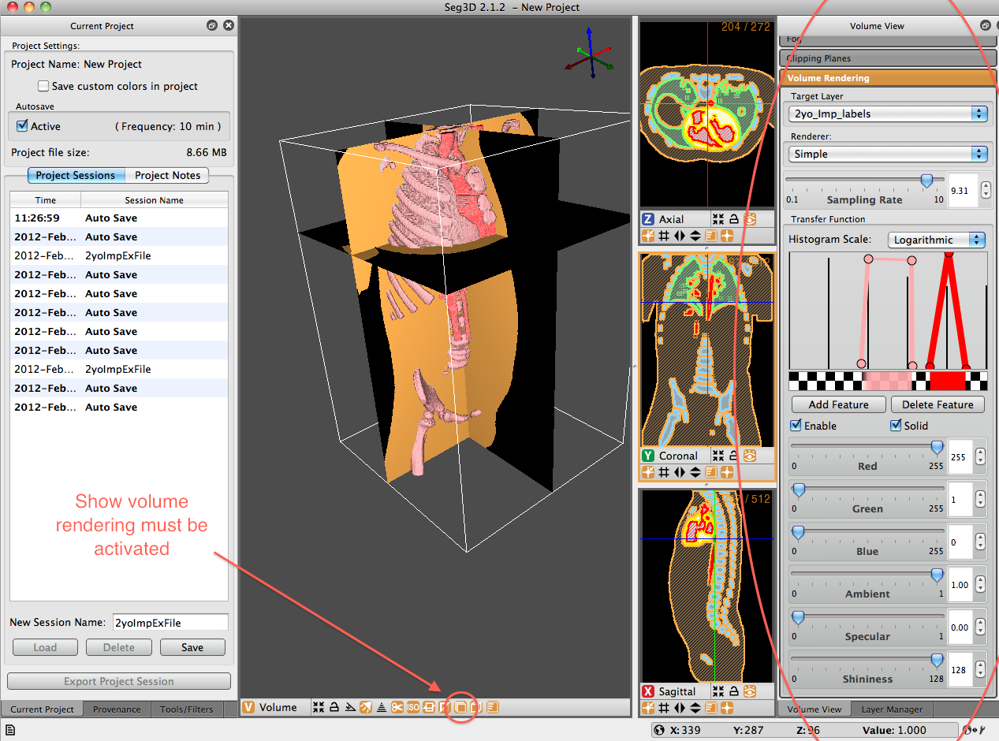

# Volume Rendering Panel

:::{figure-md} fig-vol-rend-panel

Volume View Window - Volume Rendering Panel Displayed. Show volume rendering icon at the bottom of the viewer window must be activated.
:::

The volume rendering panel allows users to generate a volume directly from the volume file, based on the application of transfer functions. These volume representations are created by extracting values from the transfer functions available and displaying them on a slice-by-slice basis. If the user zooms the image in closely, each individual slice can be seen ({numref}`fig-vol-rend-opt`). The user must define the volume over which they would like to perform the volume rendering. The user must also make sure that the ’show volume rendering’ option is selected at the bottom of the 3D viewer window.
