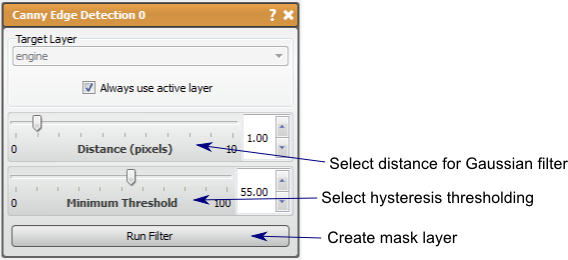

# Canny Edge

This filter will output the pixels that are edges in a mask layer.

## Detailed Description

The Canny Edge filter computes the edges in a data layer using a Canny Edge Detection Filter {cite:p}`Can1986`. This filter will output the pixels that are edges in a mask layer.

This filter is composed of four steps:

1. Smooth the input image with Gaussian filter.
2. calculate the second directional derivatives of the smoothed image.
3. Non-Maximum Suppression: the zero-crossings of the 2nd derivative are found, and the sign of the third derivative is used to find the correct extrema.
4. The hysteresis thresholding is applied to the Gradient Magnitude (multiplied with zero-crossings) of the smoothed image to find the link edges.

There are two parameters for this filter, *distance* and *minimum threshold*. The *distance* parameter is the controls the Gaussian blurring in the first step and is the same as in the Gaussian blur filter. Higher distance will result in fewer edges detected and the edges that are detected will likely be thicker. This is because these edges are being blurred out. The *minimum threshold* parameter controls the hysteresis thresholding in the fourth step. This parameter will set the level of that will count as an edge or not. This means that a higher minimum threshold will have fewer edges in the result and the remaining edges while more likely be true edges.

