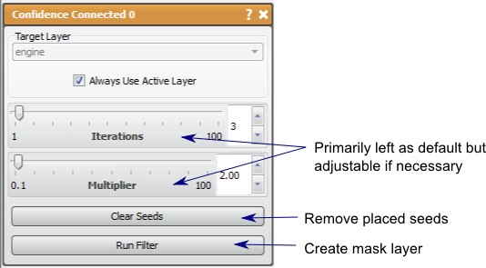

# Confidence Connected

This filter will produce a mask of pixels statistically similar to pixels surrounding defined seed points.

## Detailed Description

The Confidence Connected filter is similar to the Neighborhood Connected filter in that it will find connected pixels in a data volume that are statistically similar to pixels surrounding the user defined seed points and output them as a mask layer. The seed points set in the 2D viewer (**left mouse** to place, **right mouse** to remove).

The pixels neighboring the provided seeds are used to calculate the initial statistics, the variance and mean, then the connected pixels that fit the threshold region defined by the *Multiplier* parameter (number of standard deviations from the mean) are selected. This process is repeated by recalculating the statistics of the selected region and recomputing the connected region based on these new values. Therefore, the filter can be repeated many times.

The two parameters in this filter are *Iterations* and *Multiplier.* The *Iterations* parameter describe the number of times the statistics and connected region are calculated. Small increases in the number of iterations may not significantly alter the results. The *Multiplier* parameter describes the threshold of the pixel intensities as described in the previous paragraph. The higher the multiplier the more pixels will be selected by the filter. A small increase in this parameter can very significantly alter the results of the filter.

Note: The default values (Iterations=3 and Multiplier=2) should be the best values for most sources of image data.

