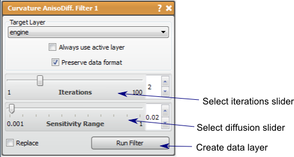

# Curvature Anisotropic Diffusion

This filter performs anisotropic diffusion using the modified curvature diffusion equation (MCDE).

## Detailed Description

The Curvature Anisotropic Diffusion performs anisotropic diffusion on a data layer using the modified curvature diffusion equation (MCDE). Anisotropic diffusion filtering is used to reduce noise (or unwanted detail) in images while preserving specific image features, such as edges and is based on the work of Pietro Perona and Jalhandra Malik, {cite:p}`PM1990`. The output of this filter is a smoothed data layer.

The parameters for this filter are *Iterations* and *Sensitivity Range.* The *iterations* parameter will control how many iterations of the filter will be executed. The more iterations, the smoother the image. The *sensitivity range* parameter controls the 'diffusion' of the objects in the image, therefore the higher the sensitivity, the more 'diffusion' and thus more smoothing.

