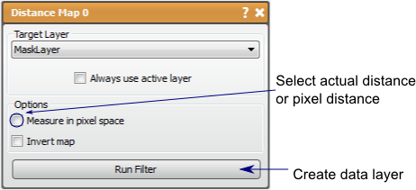

# Distance Map

This filter will calculate the distance to the surface of the mask from within the volume.

## Detailed Description

The Distance Map filter will calculate the distance to the surface of a mask for every pixel in the volume. This filter will output a distance map as a data layer with the values considered inside the mask marked as negative. This filter is useful in many applications, such as providing an indicator function for the surface of the mask. This distance map can also be used to generated a smoother isosurface than may be possible from the original segmentation. The user may choose between pixel distance or actual distance.

