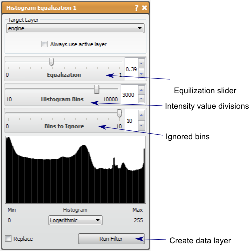

# Histogram Equalization

This filter attempts to transform histogram data to be flat as possible.

## Detailed Description

The Histogram Equalization filter will compute the histogram of the data image layer and attempt to transform the image so that the histogram is as at as possible. The result of this transformation is most often an increase in contrast that can be considered a visual enhancement of the image.

There are three parameters to this filter: *Equalization, Histogram Bins,* and *Bins to Ignore.*

The *Equalization* parameter provides the most obvious difference to the image. This filter will combine the original image and the Histogram Equalized image in the result and this parameter controls the contribution of each. When the *Equalization* is 1, the result will be only the equalized image, and when the *Equalization* is 0, the original image will be returned.

The *Histogram Bins* parameter controls the number of bins used in the original histogram used to calculate the transformation, thus this parameter essentially controls the resolution of the intensity transform. This means that the lower number of bins, the fewer intensity values used in the final image, which can reduce smooth transitions in the image. Generally, having a higher bin number is better to maintain a smooth image, but the bin number need not be higher than the number of origin possible l intensity values, which is usually dependent on data type. If the data type is unsigned 8 bit integers, for example, there are 256 intensity values, so more than 256 bins in the filter will not affect the result.

The *Bins to Ignore* parameter controls the number of ignored bins in the intensity transformation. When bins are ignored, the pixels that would have been in the bins are moved to the next. The result of this is that the resulting value range is altered, which could provide additional contrast in some areas.

