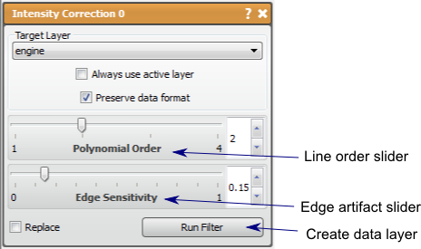

# Intensity Correction

This filter attempts to make a homogeneous intensity over the data layer.

## Detailed Description

The Intensity Correction filter attempts to make the intensity over the data layer homogenous. This is very useful when dealing with MR images, as the intensity values and contrast can vary over space due to magnetic field variations. This filter will attempt to fit a spline to average intensity of the image, then to use that spline to equalize the intensity values over the space.

There are two parameters in this filter, *polynomial order* and *edge sensitivity.*

The *polynomial order* parameter controls the kind of line used to correct the image. A *polynomial order* of 1 assumes that any changes in intensity is linear through the image. A higher *polynomial order* may be needed if there are more complex patterns of intensity variation, such as seemingly isolated regions of high or low intensities.

The *edge sensitivity* parameter controls the correction algorithm that prevents artifacts do to edges in the image. The higher the sensitivity, the less the algorithm will correct for edge artifacts. As *edge sensitivity* approaches 0, the algorithm attempts to leave edges unchanged and may suppress the Intensity Correction altogether.

