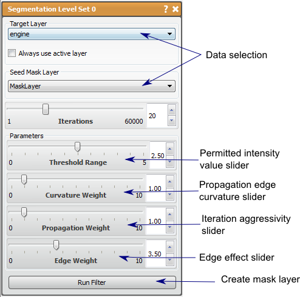

# Segmentation Level Set

This filter iteratively seeks regions similar to a given seed volume.

## Detailed Description

The Segmentation Level Set filter is an iterative segmentation filter that uses a seed volume to find the regions in a data volume that are similar to the original seed. From mask layer provided as the seed, the statistics of the seeded region are calculated. The filter will then expand the segmented region to surrounding pixels that match the statistics of the original seeded area. The propagation may also retract the segmented area in some cases if the seeded areas do not meet the criteria from the threshold range or edge weight. The filter will continue to expand (or contract) until the iterations are terminated.

To run this filter, choose a data layer and a mask layer to use as the seed. The more complete the seed layer is, the fewer the iterations needed to obtain the desired segmentation. With the proper layers selected, alter the parameters as desired and press *Run Filter.* A new layer will appear and will update the results of the filter with each iteration. The user may wait until the filter performs the set number of iterations, or may terminate the process if the desired volume is achieved by pressing Finish in the new layer created in the layer window.

The parameters in this filter to modify are: *Iterations, Threshold Range, Curvature Weight, Propagation Weight,* and *Edge Weight.*

Intensity values permitted to by included in the propagation of the segmented region. This range is related to the standard deviation of the original seed volume. If this parameter is set too low, so of the seed region will be removed as the segmentation propagates. If this parameter is set to 0, there will be no output data. This is the most strict parameter, in that all other parameters are met after the threshold range is established.

The *CurvatureWeight* parameter will control the propagation edge in terms of curvature. The higher the *CurvatureWeight,* the smother the boundary will be. It should be noted that curvature can only be weighted in the range set by both the *Threshold Range* parameter and the *Edge Weight* parameter, and therefore may not alter the end result if the regions defined by these other parameters is too narrow.

The *Propagation Weight* parameter controls how aggressive each iteration will be in determining surrounding pixels that may fit the criteria of the filter. The high the *Propagation Weight,* the further the filter searches on each iteration, and therefore the faster it fills a region that matches the criteria. Having a high propagation may also cause the to jump gaps that may not be desired, so it is prudent to reduce the propagation weight in such cases. The *Propagation Weight* should be greater than 0 to avoid reduction of the volume.

The *Edge Weight* parameter will control how much effect the edges in the data volume effect the propagation pathway. The Higher the *edge weight,* the more the filter avoids filling in edges, though the propagation may cause the expansion to fill around the edge. It should be noted that the filter is very sensitive to this parameter, so that it should be increased with small increments. Too high of a *edge weight* could cause holes to appear in what may seem like homogeneous regions.

On a final note, when the segmentation level set filter is run with the *edge* and *curvature weight* at zero and high enough iterations, the result will likely seem similar to the Confidence Connected filter, but will require much more compute time to reach it. This can be useful to try when first using this filter on new data, as it will help tune the threshold range better. With that in mind, suggested parameters for novices are: high *Threshold Range* (above 2.5, but 5 might be best), high *Propagation Weight* (Use max unless doing fine tuning or very coarse data), and low *Edge Weight* (less than 1 unless very smooth data). The filter is not as sensitive to the *Curvature Weight* and the *Iterations* can be increased as much as desired.

