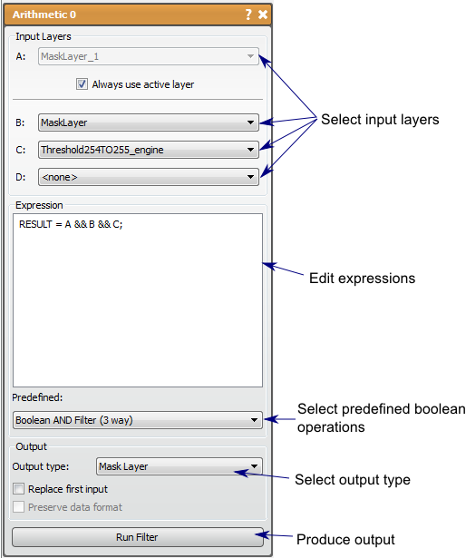

# Arithmetic

This filter runs basic boolean operations on a pixel by pixel basis.

## Detailed Description

The Arithmetic filter allows the user to run basic arithmetic and boolean operations on both image and mask data on a pixel by pixel basis. This filter can handle up to four inputs and can be used to perform calculate any expression provided by the user (correct syntax is `RESULT = \<expression\>;`). There are also many saved expressions that exists as separate filters or tools, the main difference is the functionality to handle more than two inputs.

Any operation can be performed on either type of data, but it should be noted that if a boolean operator is performed it uses zero and non-zero values as the only two possible cases. This applies to using data layers and also values that may be the summation of mask layers.

This filter also enables outputs of both data and mask layers. The filter will switch the output the match the input if the input is changed, but it can be changed afterward. If there are multiple values in the mathematical result, but mask layer output is chosen, the filter will perform a threshold to try and capture the relevant data in a mask, usually capturing values over zero in the data.

