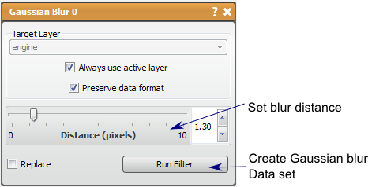

# Gaussian Blur

This filter performs a smoothing on the data layer.

## Detailed Description

The Gaussian Blur filter performs a smoothing on the data layer using a discrete Gaussian kernel. For every pixel (except the edges), this filter performs a weighted averaging of the neighboring pixels where the weights are a 3D Gaussian distribution centered at the pixel. This filter will reduce noise by averaging it out, but will also reduce edges.

The *distance* parameter set with the slider bar in the tool window determines the size of the neighborhood so that the bigger the distance, the greater the area of averaging and thus more blurring. Since the *distance* parameter is the only exposed parameter, the variance is dependent on the distance.

