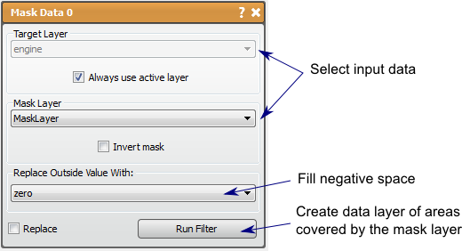

# Mask Data

This filter will use a mask layer to discard data in the data layer.

## Detailed Description

The Mask Data filter will use the second input of a mask layer to selectively discard (retain) data in a data layer. The pixels in the data layer that correspond to marked pixels in the mask layer will be kept, and the remaining pixels will be discarded by setting them to some background value. The background value can be set to zero, the original max or min value, or the new max or min value. This can be useful in isolating regions of interest and will eliminate noise from outside the region. This filter could also cause artificial edges to occur.

