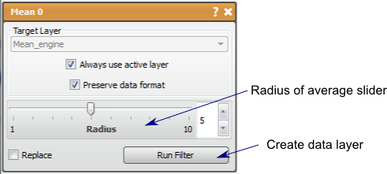

# Mean

This filter performs smoothing on the data layer using a step function.

## Detailed Description

The Mean filter performs a smoothing on the data layer using a discrete step function kernel. For every pixel (except the edges), this filter performs an averaging of the neighboring pixels. This filter will reduce noise by averaging it out, but will also reduce edges. The neighborhood size is controlled by the distance parameter, the greater the distance, the more smoothing.

