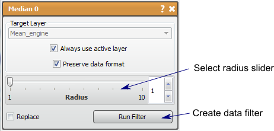

# Median

This is a nonlinear filter for reducing noise but maintaining edges.

## Detailed Description

The Median filter is a non-linear filter that will reduce noise (speckle), but may also preserve or enhance sharp boundaries. For every pixel (except the edges), this filter finds the median value of the neighboring pixels and uses this value to replace the original pixel. This causes the edges to be preserved, if the neighborhood is appropriately sized, while eliminating subtle variations.

The neighborhood is controlled by the *distance* parameter. Though increasing the distance will also increase the smoothing, it is because the size requirement for regions to not be eliminated. Clear divisions of large regions will increase in contrast and smaller regions will be smoothed out.

