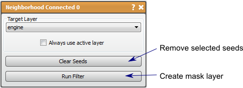

# Neighborhood Connected

This filter creates a mask indicating pixels within a value range and connected to seed points.

## Detailed Description

The Neighborhood Connected filter is like a combination of the Threshold tool and the Connected Component filter. The user places seed points in the volume using the 2D viewers (**left mouse** to place, **right mouse** to remove). Then the filter will create a mask layer marking the pixels that are within the data value range of the seed locations that are also connected to the seed points. This tools is useful in segmenting long and winding structures as long as there is sufficient contrast between the desired structure and the surrounding medium.

