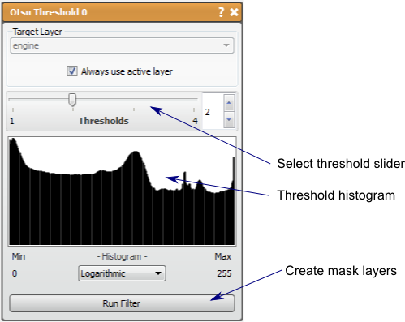

# Otsu Threshold

This filter creates a mask of regions data clusters.

## Detailed Description

The Otsu Threshold filter attempts to cluster data values in a data layer based upon how similar they are and create mask layers identifying the regions of similar data. This filter provides a good quick segmentation in many cases. There is a [Wikipedia article](http://en.wikipedia.org/wiki/Otsu%27s_method) containing a good description of the Otsu threshold algorithm.

Using the Ostu Threshold filter is simple. The only parameter in this implementation is the number of thresholds (1 to 4), or the number of divisions in the volume. The results of this filter are mutually exclusive (no output will mask the same pixel as another layer) and collectively exhaustive (the whole volume will be mask by one of the output layers) so that there will be one more mask layer generated than thresholds used. A histogram is presented to aid the user in choosing the threshold number.

