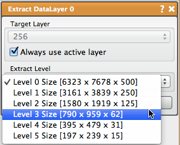

# Extract Data Layers

Select one of the levels of detail from the large data volume and convert it into a normal data layer.

## Detailed Description

Once a volume is converted, the user can run any filter on the data. Currently, data layers should not have more than 4096 pixels in a single dimension, as data layers are not rendered as bricks, but as a single texture.

It is expected that the ExtractDataLayer and Crop tools will often be used together, with a user cropping a region of the large volume and then selecting an appropriate level of resolution to convert the large volume layer into a normal data layer.

