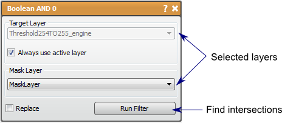

# Boolean AND

The Boolean AND filter finds the intersection of two masks.

## Detailed Description

The Boolean AND filter will input two mask layers and output the intersection of the two masks, i.e., the pixels that are masked by both of the two input masks.

