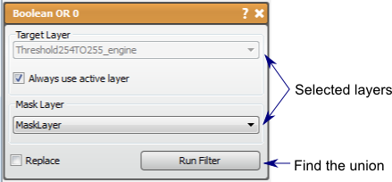

# Boolean OR

The Boolean OR filter produces the union of two masks.

## Detailed Description

The Boolean OR filter will input two mask layers and output the union of the two masks, i.e., the pixels that are masked by either of the two input masks.

