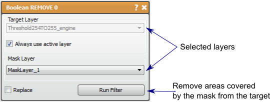

# Boolean Remove

The Boolean REMOVE filter removes the intersecting region of two masks from the first.

## Detailed Description

The Boolean REMOVE filter will input two mask layers and use the second input to remove the intersecting regions from the first. The result of this can be thought of as the first region minus the second region.

