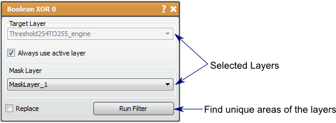

# Boolean XOR

This filter produces the unique regions of two masks.

## Detailed Description

The Boolean XOR filter will input two mask layers and output the unique union regions of the two masks, i.e., the pixels that are masked by exactly one of the two input masks. This filter is the same as removing the result of the Boolean AND filter from the result of the Boolean OR filter.

