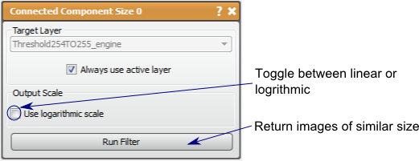

# Connected Component Size

Similar to the Connected Component filter, this filter will return a image data layer but the data value will correspond to its size (logarithmic or linear scale).

## Detailed Description

The Connected Component Size filter is similar to the Connected Component Filter, but will return a image data layer labeling each connected region with a data value corresponding to its size (logarithmic or linear scale). This allows the user to manipulate the connected regions in the volume based on size. For example, thresholding real data can yield several regions of interest that are correct maskings of the data, but may also capture small regions of noise in other areas of the scan. These small regions of noise can be eliminated using the Connected Component filter by using the Threshold tool on the result.

