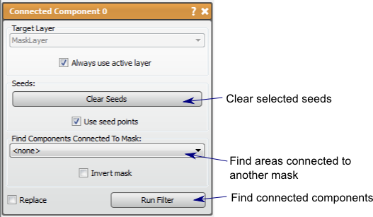

# Connected Component

This filter finds connected data regions in a mask layer that are coincident to the defined seed points.

## Detailed Description

The Connected Component filter finds connected data regions in a mask layer that are coincident to the defined seed points. This filter can be used to eliminate mask data that is not connected (separated by a blank pixel) from a desired region and can thus reduce noise in the segmentation.

The seed points are chosen by **left clicking** in the 2D viewers or deleted by **right clicking** on existing seed points. Multiple connected regions can be selected with these seed points. Another mask can be used as a seed. Using a mask layer second input field will cause the filter to find regions from the first input that are overlapping or next to any data in the second input. Additional seed points can be used or ignored with the use seed points option.

