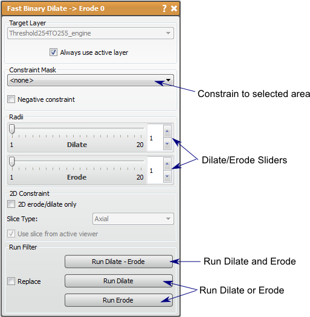

# Fast Binary Dilate Erode

This filter will make a label mask bigger or smaller.

## Detailed Description

The Fast Binary Dilate -> Erode filter will make a label mask bigger (dilate) or smaller (erode). This filter is very useful in smoothing a mask layer, as performing a dilation and erosion on a mask volume will fill in some of the details on the surface. This can be desirable if noise is the detail being filled in. The opposite (erode then dilate) will also smooth, but it will reduce protruding details in the volume. Either type smoothing should be done carefully as important details may be smoothed in addition to the noise of the segmentation. The amount of smoothing is directly proportional to radius of each step. The radii are controlled by the slider in the tool window.

There are several features of this filter that allow high level manipulation of the dilate and erode functions. First is the ability to add a constraint to the algorithm. The constraint will not allow the dilation or the erosion of the original mask to exceed the boundary of the constraint mask. Another feature is to dilate and erode in a specified plane, which can be specified in the viewer or with the drop down menu (disable the *use slice from active viewer* option) An example of when this is useful is when there is a much bigger spacing in one direction, therefore the 3D dilation extends much further in space in that direction and can cause unwanted closing.

It should be noted that the edge of the volume provides complications to this filter. If the mask layer is touching the edge of the volume and erode is performed, the edge slice will perform a 2D erosion only, so that the mask still connects to the edge. This can become a problem when the original mask data is near the edge, but not touching, then *dilate - > erode* is run so that the dilate causes the mask to touch the edge. The erosion will then leave the mask touching the edge of the volume.

This filter and Smooth Binary Dilate -> Erode are similar in function, but are slightly different in the results. As the name suggests, Fast Binary Dilate -> Erode is the faster filter of the two, but the solution may produce corners in the data instead of smooth surfaces. The runtime of Fast Binary Dilate -> Erode is dramatically less and will the results will be indistinguishable with moderate radii and number of eroding and dilating steps.

