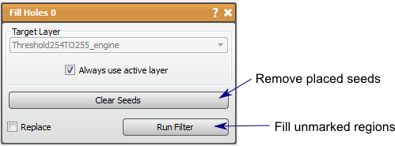

# Fill Holes

This filter can be used to fill unmarked regions in a mask layer.

## Detailed Description

The Fill Holes filter can be used to fill unmarked regions which are surrounded by a data in a mask layer. This is useful when automated segmentation techniques leave false negative noise, or regions that should have been marked but aren't. This filter will only fill regions that are completely surrounded with mask data. Therefore, if the filter appears to not work at filter, check the holes and make sure they are not exposed to the background. The seed points can be used to if there is a hole that is on the edge, but the hole must not be the majority of the edge, i.e. the background. In this case the seeds are used to identify the background. Seed points are not needed otherwise.

