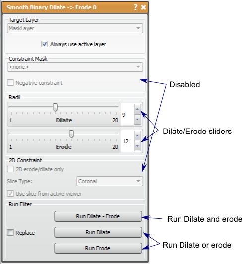

# Smooth Binary Dilate Erode

This filter will make label masks bigger or smaller with additional smoothing to the mask.

## Detailed Description

This filter will make a label mask bigger (dilate) or smaller (erode). This filter is very useful in smoothing a mask layer, as performing a dilation and erosion on a mask volume will fill in some of the details on the surface. This can be desirable if noise is the detail being filled in. The opposite (erode then dilate) will also smooth, but it will reduce protruding details in the volume. Either type smoothing should be done carefully as important details may be smoothed in addition to the noise of the segmentation. The amount of smoothing is directly proportional to radius of each step. The radii are controlled by the slider in the tool window.

Though there appears to be several features similar to the Fast Binary Dilate -> Erode filter, these have been disabled due to complexity issues from this filter.

It should be noted that the edge of the volume provides complications to this filter. If the mask layer is touching the edge of the volume and erode is performed, the edge slice will perform a 2D erosion only, so that the mask still connects to the edge. This can become a problem when the original mask data is near the edge, but not touching, then *dilate -> erode* is run so that the dilate causes the mask to touch the edge. The erosion will then leave the mask touching the edge of the volume.

This filter and Fast Binary Dilate -> Erode are similar in function, but are slightly different in the results. As the name suggests, Smooth Binary Dilate -> Erode will produce a smoother surface after each step due to an additional correction in the algorithm. This additional step adds to runtime dramatically. You should use this algorithm if the radii used are large, or if the erosion and dilation are performed multiple times each.

