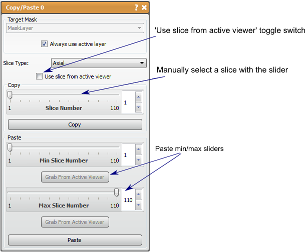

# Copy/Paste

This tool allows the user to copy and paste data from one mask to another.

## Detailed Description

This tool uses only mask layers as inputs. It is used to modify mask layers to repeat a slice of interest. This tool is similar to the basic features found in Copy/Paste Mask Slice. The key difference between the edit functions and this tool is that this tool provides more flexibility with the pasting options, offering pasting anywhere from one slice to the whole volume. The editing options only offer the extremes of pasting a single slice or punching a copied slice through the whole volume. This tool is most useful for pasting multiple slices but not necessarily the entire volume.

The Copy/Paste tool has two functions, copy and paste. The copy buffer only saves one copied slice at a time. This means that only one slice can be pasted, though it can be pasted to many slices. The slice to be copied can be specific in two ways, from the viewer (when *use slice from active viewer* is checked) or using a slider and specifying the direction (make sure *use slice from active viewer* is unchecked). You should be careful using either option to make sure the correct plane is active/selected. To copy the slice, press the *copy* button near the middle of the tool window.

The paste option is a little more complicated, as the user must specify the slice boundaries for the pasting. This can be done using the provided sliders of by navigating the slice and pressing the grab from viewer. The user will need to ensure that the same plane is chosen for the pasting and the copied slice. Also, it should be noted that the software will not constrain the maximum to be more than the minimum, or vis versa. If the maximum is lower than the minimum, the tool will still use the slices described and the slices will be pasted. Press the *paste* button when the correct slice range is specified to finish.

This tool will modify the original layer without an option to create a new layer with the action.

