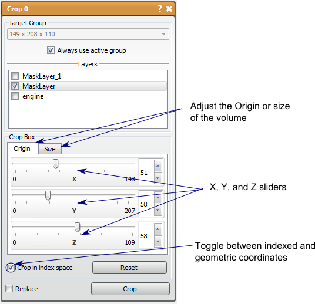

# Crop

The Crop tool will crop one or more layers to a specified size. This tool will clip multiple layers from the same group to the same size by choosing them in the list of layers near the top of the window. The Crop tool also works on the new Seg3D large volume data layer format.

## Detailed Description

The size of the new volume can be specified using the sliders in the tool window, or by adjusting the widget in the 2D viewing windows. The sliders in the tools window will specify the origin and the size of the cropping region. The buttons over the slider specify which parameter is displayed. It should be noted that you can display the indexed or geometric coordinates by checking/unchecking the *crop in indexed space* option near the bottom of the window.

The Crop widget is shown as a red box in the 2D viewers. This can be adjusted in any plane by clicking and dragging on the edge to change the size, or in the middle to change the origin. The mouse pointer will change to indicate which function will be affected. Press *Crop* to finish cropping the volumes.

Currently, data layers should not have more than 4096 pixels in a single dimension, as data layers are not rendered as bricks but as a single texture.  

