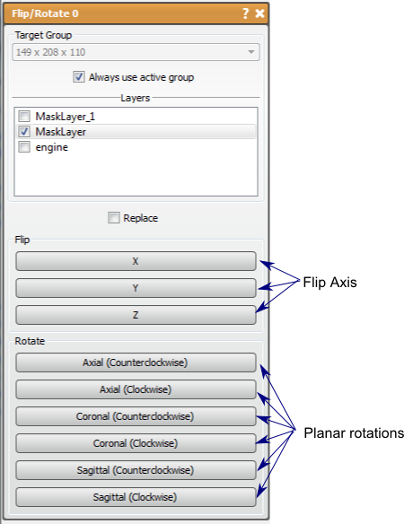

# Flip/Rotate

This tool will flip or rotate one or more layers around an axis.

## Detailed Description

The Flip/Rotate tool will flip or rotate 90 degrees one or more layers around a specified axis. This tool will flip/rotate multiple layers from the same group to the same size by choosing them in the list of layers near the top of the window. After choosing the desired layers to flip/rotate, the action is performed when the button for that action is pressed. There are three flipping options (flipping each axis) and six rotation option (clockwise and counter-clockwise in each plane).

