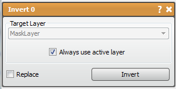

# Invert

This tool will make a negative of the input data.

## Detailed Description

This tool will invert the data in a layer to its minimum and maximum, making a negative of the input data. If performed on a mask layer, this tool will be a mask of everything in the volume besides the original mask. If performed on image data, the intensities will be reversed so that the dark areas look light and vis versa.

