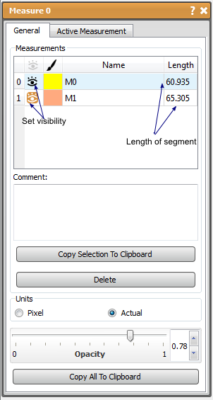

# Measure

The Measure tool will calculate the distance between two points chosen in the viewer windows. The points, line segments, and measurements in the 2D viewers and record the measurements in a table in the tools window. This tool will calculate and retain several different distances allowing the user to copy the measurements to other software (as a text or into a spreadsheet) using the two copy functions in the tool window (*selection* or *all data*).

## Detailed Description

The user can choose which measurements are visible, change the color, name, and add comments of each of the measurements by **double clicking** on the parameter in the table, or by highlighting the measurement in the able and clicking the active measurement tab. A new measurement automatically becomes active. Using this tab, the user can also center all the active viewers (with picking form other planes allowed) on the points that are in the measurement.

Back in the general tab, the active layer can be deleted and the opacity of the visualizations in the viewers can be adjusted. Both tabs allow switching between pixel (indexed) and actual (geometric) distances. When this is changed in the active measurement tab, it changes all the measurements.

```{list-table} Keyboard and Mouse Actions in the for the Measure Tool
:widths: 25 75
:width: 100%
:header-rows: 1

* - Action
  - Function

* - ctrl/cmd
  - snap to axis

* - middle mouse button
  - snap to slice

```


