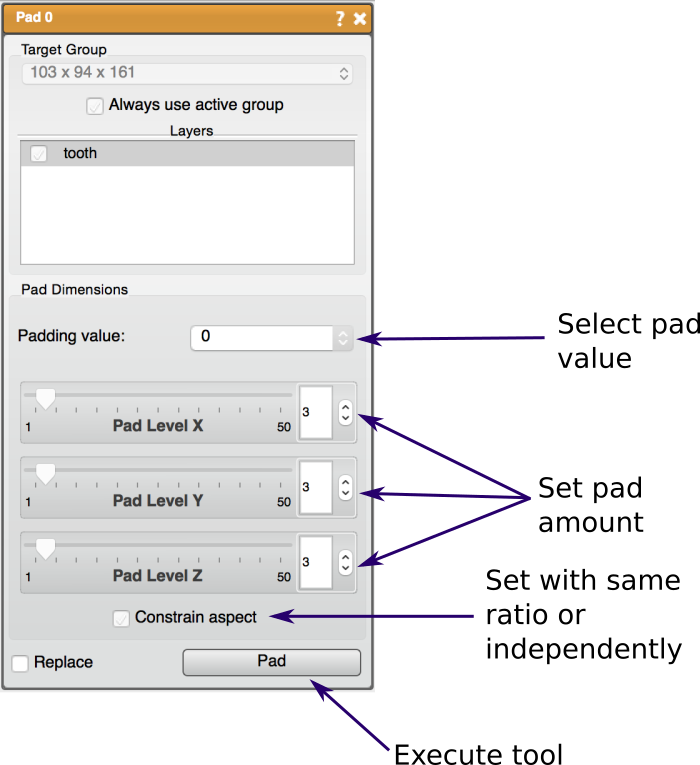

# Pad

The Pad tool allows the user to pad one or more volumes. This tool can be used on both mask and data layers.

## Detailed Description

The Pad amount is set manually using the sliders. There are options to resample with the same ratio in every direction (check *Constrain Aspect* option) or to resample each direction independently (must uncheck *Constrain Aspect* option to enable). Pad values can be zero, the dataset min or max.

