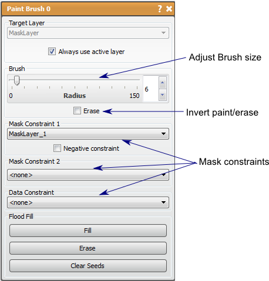

# Paint Brush

The Paint Brush tool a tool that allows full manual creating and editing of mask layers. This tool allows the user to specify explicitly which pixels to include in the mask label. This tool can only manipulate existing mask layers (can be empty).

## Detailed Description

The Paint Brush size can be changed with the scroll wheel or in the tools window using the slider. The **left mouse** button paints and the **right mouse** button erases, but this can be reversed by checking the *Erase* option.

You can constrain the Paint Brush with other mask layers (up to two) or with a data layer and threshold limits (this is the same as creating a threshold mask layer and using it as a constraint) to limit the pixels that can be painted.

There is a *flood fill and erase* function which will fill an area in the slice that is completely surrounded with the mask layer, or delete a connected region. If no seed points are used with these functions, the entire slice will be filled or erased. Seed points are chosen with **alt+left mouse** button.

It should be noted that since this tool uses the scroll function to change the Paint Brush size, it will not also change the slice in the viewer. To change the slice use the arrow **up/down** or **shift+scroll**.

```{list-table} Keyboard and Mouse Actions in the for the Paint Brush Tool
:name: table-paint-brush-actions
:widths: 25 75
:width: 100%
:header-rows: 1

* - Action
  - Function

* - left mouse
  - Paint

* - right mouse
  - Erase

* - scroll up/down
  - increase/decrease brush size

* - alt+left mouse
  - add seed point

* - alt+right mouse
  - remove seed point

* - C
  - clear seed points

* - F
  - Paint flood fill

* - E
  - Erase flood fill

```


