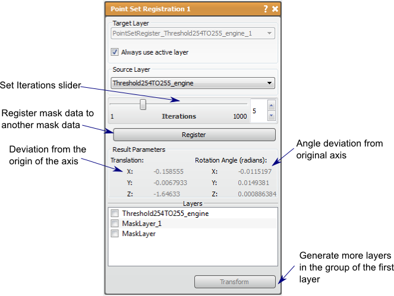

# Point Set Register

This tool will register one mask layer to another.

## Detailed Description

The Point Set Registration tool will register one mask layer to another mask layer. This is currently the only tool or filter that will take inputs from two different layer groups as the main purpose of this tool is to allow the user to map a segmentation from one grid to another with a similar mask layer. The tool attempts to register the entire mask data to another mask data using the iterative closest points method(rigid registration) and will save and display the transform generated for use on the other layers in the registered layer's group. Since this is an iterative method, the user can set the number of iterations.

To run this registration, choose for the first input the mask layer in the destination frame (to register to) and the mask to change (register) as the second input. The ideas is that these would be in separate layer groups. Clicking the register button will create a new layer in the group of the first input and the transformation will be saved and displayer (translation and rotation). There will be a list of other mask layers from the second input's group with which the user can select the layer on which to perform the saved transform. Upon pressing transform, more layers will be generated in the group of the first input layer.

