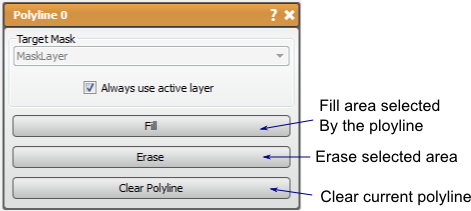

# Polyline

The Polyline tool allows the user to define a region of the layer to modify by adding or erasing the data in the region defined by the polyline.

## Detailed Description

The Polyline tool is a tool that allows manual creating and editing of mask layers. The polyline tool allows the user to define a region of the layer to modify by adding or erasing the data in the region defined by the polyline. This tool can only manipulate existing mask layers (can be empty).

The Polyline is created by clicking with the **left mouse** on the 2D viewer. The polyline can be modified in any plane, but will only fill/erase in the active plane. The polyline will try to order the new point in between two existing points to make as smooth a shape as possible. This means that the user should try to place a few points around the edge of the shape desired to create a coarse shape and then fill in the details as needed. points can be moved with the **left mouse** button (pointer will turn into a hand) and deleted with the **right mouse** button. The whole polyline can be moved with the **shift+left mouse** on one of the points.

Once the desired region is designated by the Polyline, the user can fill the area or delete the mask data in the area. This tools then is like the Paint Brush tool, where the brush can be shaped in any way. The polyline will remain as the slice changes, so that the user can modify the existing polyline instead of creating a new one. If desired, a new polyline can be created by clearing the polyline and starting fresh.

```{list-table} Keyboard and Mouse Actions in the for the Polyline Tool
:name: table-polyline-actions
:widths: 25 75
:width: 100%
:header-rows: 1

* - Action
  - Function

* - left mouse
  - add or move point

* - right mouse
  - erase point

* - shift+left mouse
  - move Polyline (on one of the points)

* - F
  - Paint flood fill

* - E
  - Erase flood fill

```


