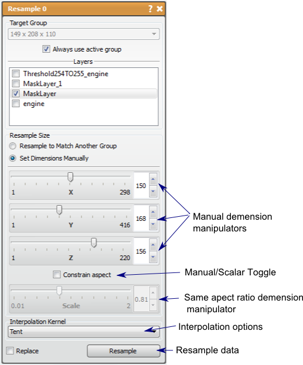

# Resample

This tool allows the user to resample one or more volumes to change the resolution.

## Detailed Description

This tool can be used on both mask and data layers.

The resampling can be set manually using the sliders, or by trying to match the element number of another layer group. To manually choose the resampling, there are options to resample with the same ratio in every direction (check *Constrain Aspect* option) or to resample each direction independently (must uncheck *Constrain Aspect* option to enable). To resample to match another group, you must have another layer group loaded. You may choose the desired group from the drop down menu and the padding value.

Interpolation of the data is often needed when resampling, especially with image data. There are several options for interpolation in the Resample tool: Box, Tent, Cubic (Catmull-Rom and B-spline), Quartic, and Gaussian which are provided by the Teem library, and Linear, B-spline and Nearest Neighbor from the ITK library. You may choose the interpolation method in the drop down menu near the bottom of the tool window.

Resampling a layer to match the geometry of another group can also be done by clicking (left mouse button) on a layer while holding down the Shift key, and dragging the layer to the destination group.

